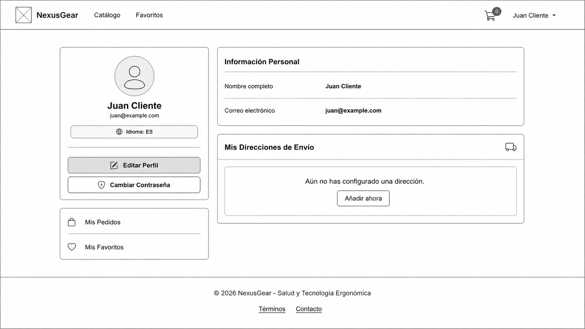
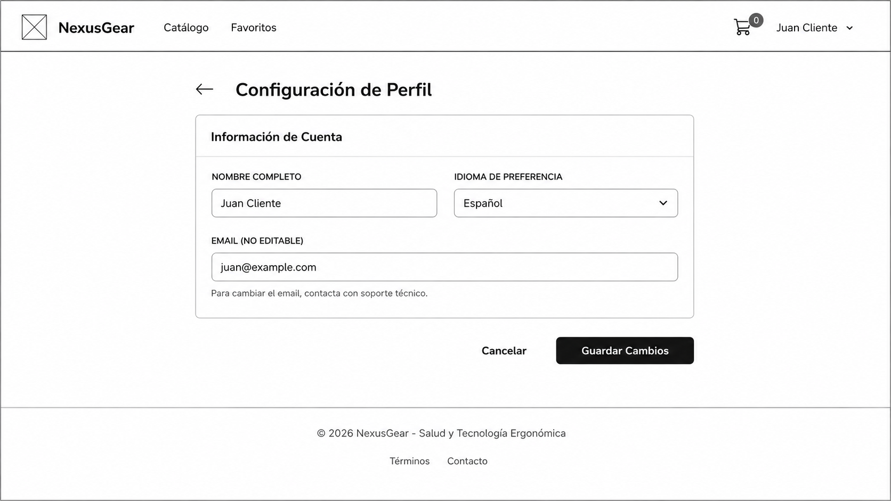
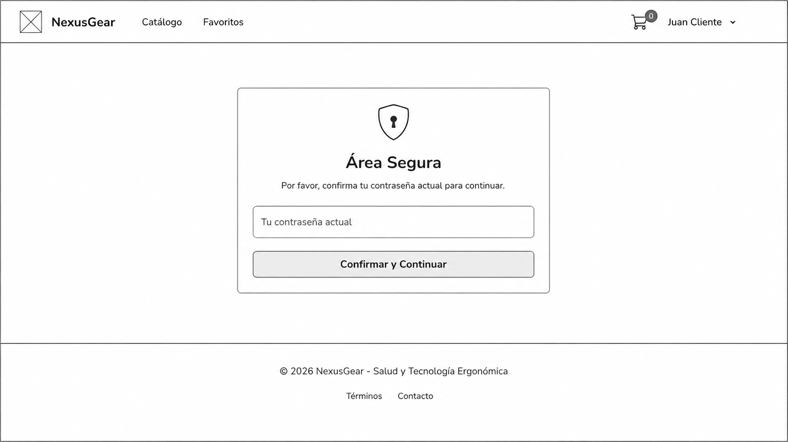
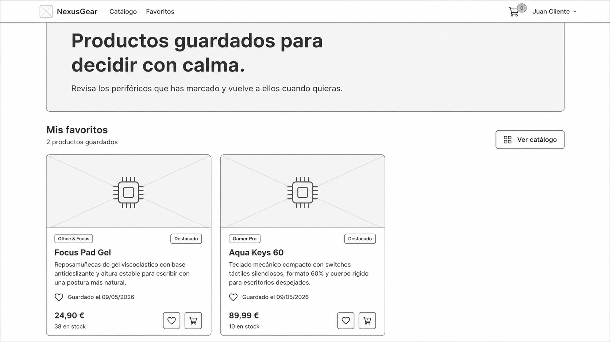
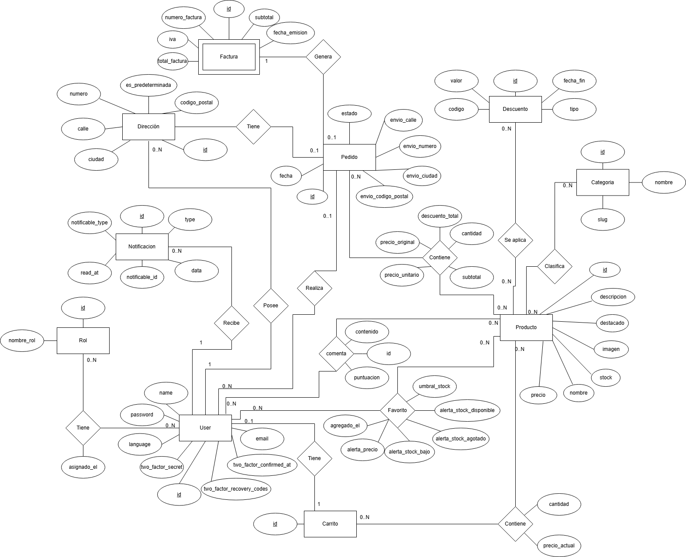

# NexusGear

**Comercio electrónico de periféricos ergonómicos**

**Autores:** Alonso Jiménez Flores, Daniel Valladolid Moreno y Javier Sánchez Claro  
**Fecha:** Junio de 2026

# Resumen

NexusGear es una aplicación web de comercio electrónico orientada a la venta de periféricos tecnológicos ergonómicos. El proyecto desarrolla una experiencia completa de tienda online: catálogo público, registro e inicio de sesión, carrito, favoritos, direcciones, comentarios, compra, pedidos, facturas, notificaciones y panel de administración.

La aplicación busca resolver un problema habitual en la compra de tecnología: la dificultad para encontrar productos adecuados entre muchas opciones, con información dispersa, cambios de stock, descuentos y preferencias personales. Para ello, NexusGear organiza el catálogo por categorías y perfiles de uso, permite guardar productos de interés y ofrece una configuración inicial que ayuda a adaptar la experiencia desde el primer acceso.

Además del flujo principal de compra, la entrega final incorpora pagos en modo test, despliegue reproducible con Docker, uso de Redis para cache, sesiones y cola de trabajos, y MongoDB para registros no relacionales de búsquedas, auditoría administrativa y errores. La solución queda desplegada públicamente en `https://nexusgear.duckdns.org` y mantiene un entorno local reproducible para pruebas y defensa.

# Abstract

NexusGear is a web-based e-commerce application focused on ergonomic technology peripherals. The project implements a complete online store experience: public catalogue, user registration and login, cart, favourites, addresses, comments, checkout, orders, invoices, notifications and an administration panel.

The application addresses a common issue in technology shopping: users often face too many product options, changing stock, discounts and personal preferences that are not reflected early enough in the buying process. NexusGear structures the catalogue around categories and usage profiles, allows users to save products of interest and includes an onboarding flow to adapt the experience from the beginning.

In addition to the main purchasing workflow, the final version includes test payments, a reproducible Docker-based environment, Redis for cache, sessions and queues, and MongoDB for non-relational search logs, administrative audit records and error tracking. The application is publicly deployed at `https://nexusgear.duckdns.org` and keeps a local environment ready for validation and demonstration.

# 1. Introducción y contexto

## 1.1 Descripción general

NexusGear parte de la necesidad de tecnologías para distintos usuarios construir un comercio electrónico realista con Laravel, Bootstrap 5, autenticación, panel de administración, base de datos relacional, uso de correo mediante SMTP y documentación técnica progresiva.

La temática elegida es la venta de periféricos ergonómicos para personas que pasan muchas horas frente al ordenador. La aplicación se dirige principalmente a dos perfiles:

- **Office & Focus**: usuarios que priorizan comodidad, productividad y salud postural durante jornadas largas de trabajo.
- **Gamer Pro**: usuarios que buscan periféricos de alto rendimiento sin renunciar a la ergonomía.

La entrega final desarrolla el flujo de una tienda funcional: catálogo público, carrito para visitantes y usuarios, registro, verificación de correo, checkout con pago en modo test, pedidos, factura, confirmación por correo, favoritos, comentarios, notificaciones y administración separada mediante roles.

## 1.2 Motivación

La motivación principal del proyecto es unir experiencia de usuario e integridad de datos en una tienda online realista. En un comercio electrónico no basta con mostrar productos: el sistema debe evitar stock negativo, impedir que un usuario consulte pedidos ajenos, conservar precios históricos aunque cambie el catálogo y ofrecer mensajes claros en los momentos críticos.

NexusGear también introduce una capa de personalización inicial. El onboarding permite conocer preferencias básicas del usuario desde el principio. Esta información, junto con búsquedas, favoritos y comportamiento de compra, abre la puerta a mejoras futuras de recomendaciones, marketing, comunicaciones más ajustadas al perfil del cliente y filtros preaplicados por defecto.

## 1.3 Tecnologías principales

| Tecnología      | Uso en el proyecto                                                                                     |
| --------------- | ------------------------------------------------------------------------------------------------------ |
| Laravel 12      | Framework principal, rutas, controladores, modelos, migraciones y servicios.                           |
| Laravel Fortify | Registro, login, verificación de correo, recuperación de contraseña, confirmación de contraseña y 2FA. |
| Eloquent ORM    | Relaciones, consultas, accessors, scopes y persistencia relacional.                                    |
| Blade           | Plantillas del sitio público, área privada, administración y correos.                                  |
| Bootstrap 5     | Base responsive de la interfaz, formularios, navbar, botones y componentes.                            |
| Vite + SASS     | Compilación de estilos propios y assets frontend.                                                      |
| MySQL           | Base de datos relacional principal en Docker y despliegue.                                             |
| SQLite          | Base de datos en memoria para pruebas automatizadas.                                                   |
| Redis / Predis  | Cache, sesiones y cola de trabajos en Docker y VPS.                                                    |
| MongoDB         | Logs de búsqueda, auditoría administrativa y errores.                                                  |
| Stripe          | Pasarela de pago en modo test mediante Stripe Checkout.                                                |
| Docker Compose  | Entorno reproducible con PHP-FPM, Nginx, Vite, MySQL, Redis, MongoDB, Mailpit y worker.                |
| SMTP / Mailpit  | Correos de verificación, recuperación, confirmación de pedido y alertas.                               |
| PHPUnit         | Pruebas de integración sobre catálogo, carrito, checkout, admin y favoritos.                           |
| GitHub Actions  | Ejecución automatizada de tests en varias versiones de PHP.                                            |

# 2. Objetivos y requisitos

## 2.1 Objetivo general

Desarrollar un comercio electrónico funcional y defendible, con una arquitectura Laravel mantenible, una base de datos coherente, control de acceso por roles, operaciones críticas protegidas y documentación alineada con la implementación real.

## 2.2 Objetivos específicos

- Implementar un catálogo público con búsqueda, filtros, ordenación, categorías y ficha de producto.
- Permitir registro, login, logout, verificación de correo, recuperación de contraseña y autenticación en dos factores.
- Gestionar carrito para visitantes y usuarios, con fusión de carrito invitado tras login.
- Completar el flujo de compra con dirección, pago en modo test, pedido, líneas, factura, descuento de inventario y correo.
- Separar funcionalidades de cliente y administrador mediante roles, middleware y rutas protegidas.
- Permitir al administrador gestionar productos, categorías, descuentos y pedidos.
- Incorporar perfil de usuario, direcciones, cambio de contraseña, idioma, favoritos y comentarios.
- Generar alertas de favoritos por bajada de precio, falta de stock, reposición y umbral de stock bajo.
- Registrar eventos no relacionales en MongoDB para búsquedas, auditoría y errores.
- Usar Redis como soporte de cache, sesiones y cola de trabajos.
- Proporcionar una instalación reproducible con Docker Compose.
- Desplegar la aplicación en una URL pública con HTTPS.
- Mantener el proyecto bajo Git y GitHub, con ramas, issues, tags y automatización de pruebas.

## 2.3 Requisitos funcionales

La siguiente tabla consolida los requisitos descritos en el README y los requisitos incorporados durante la entrega final, de forma que ambas fuentes documenten el mismo alcance funcional.

| Código | Requisito                                                                                                                              |
| ------ | -------------------------------------------------------------------------------------------------------------------------------------- |
| RF-01  | El catálogo debe ser accesible para visitantes sin iniciar sesión.                                                                     |
| RF-02  | El usuario puede buscar productos por texto y filtrarlos por categorías, disponibilidad, precio y ofertas.                             |
| RF-03  | El sistema permite registro, login, logout, verificación de correo y recuperación de contraseña.                                       |
| RF-04  | El usuario puede configurar 2FA y completar un onboarding inicial de idioma, dirección y preferencias.                                 |
| RF-05  | El usuario puede añadir productos al carrito, modificar cantidades, eliminar líneas y vaciarlo.                                        |
| RF-06  | El carrito invitado se conserva en cookie y se fusiona con el carrito del usuario al iniciar sesión.                                   |
| RF-07  | El checkout valida carrito y stock, crea pedido pendiente, abre sesión Stripe y completa factura, stock y correo tras pago confirmado. |
| RF-08  | El usuario puede consultar sus pedidos, pero no pedidos de otros usuarios.                                                             |
| RF-09  | El administrador puede crear, editar, listar y eliminar productos cuando las reglas de integridad lo permitan.                         |
| RF-10  | El administrador puede gestionar categorías y asociarlas a productos mediante relación N:M.                                            |
| RF-11  | El administrador puede gestionar descuentos y asignarlos a productos.                                                                  |
| RF-12  | El usuario puede gestionar perfil, idioma, direcciones y contraseña desde su área privada.                                             |
| RF-13  | El usuario puede marcar productos como favoritos y configurar alertas asociadas.                                                       |
| RF-14  | El usuario puede publicar comentarios y valoraciones sobre productos.                                                                  |
| RF-15  | El sistema avisa al usuario de cambios relevantes en productos favoritos por correo y notificación web.                                |
| RF-16  | El panel de administración muestra métricas útiles a partir de consultas y vistas SQL.                                                 |
| RF-17  | La aplicación está internacionalizada en español, inglés, portugués y japonés.                                                         |
| RF-18  | El sistema registra búsquedas, auditoría administrativa y errores en MongoDB.                                                          |
| RF-19  | El sistema se puede ejecutar con Docker, incluyendo MySQL, Redis, MongoDB, Mailpit, Nginx, Vite y worker.                              |
| RF-20  | El administrador puede consultar todos los pedidos y actualizar su estado desde el panel de administración.                            |
| RF-21  | El sistema envía correos transaccionales de verificación, recuperación, confirmación de pedido y alertas cuando corresponde.            |

## 2.4 Requisitos no funcionales

| Código | Requisito                                                                                                                                              |
| ------ | ------------------------------------------------------------------------------------------------------------------------------------------------------ |
| RNF-01 | La interfaz debe ser responsive y coherente en pantallas públicas, privadas y de administración, usando Bootstrap 5 como base visual.                  |
| RNF-02 | La autenticación debe proteger contraseñas, sesiones, verificación de correo, recuperación de contraseña y rutas privadas mediante mecanismos Laravel. |
| RNF-03 | El acceso a administración debe controlarse mediante roles y middleware, impidiendo que usuarios estándar accedan a rutas internas.                    |
| RNF-04 | El modelo relacional debe respetar cardinalidades 1:1, 1:N y N:M, usando migraciones, claves foráneas, restricciones y relaciones Eloquent.            |
| RNF-05 | Las operaciones críticas del checkout deben ejecutarse con transacciones y bloqueo de productos para evitar inconsistencias de stock.                  |
| RNF-06 | La arquitectura debe separar controladores públicos, controladores de administración, modelos, servicios, vistas, traducciones y pruebas.              |
| RNF-07 | La configuración sensible debe gestionarse mediante variables de entorno para base de datos, Redis, MongoDB, SMTP, Stripe y despliegue.                |
| RNF-08 | La aplicación debe ofrecer un entorno reproducible con Docker Compose y servicios auxiliares para MySQL, Redis, MongoDB, Mailpit, Nginx, Vite y worker. |
| RNF-09 | Las pruebas automatizadas deben poder ejecutarse con SQLite en memoria y dobles de prueba para correo, notificaciones y pago.                          |
| RNF-10 | El proyecto debe mantenerse bajo Git y GitHub, con ramas de funcionalidad, issues, tags y commits descriptivos.                                        |
| RNF-11 | La aplicación debe estar internacionalizada mediante ficheros de idioma y middleware de selección de locale.                                           |
| RNF-12 | El despliegue público debe estar disponible mediante HTTPS en `https://nexusgear.duckdns.org`.                                                         |

## 2.5 Trazabilidad requisito-tarea

| Requisito            | Tareas principales                                        | Prioridad | Dificultad | Estado             |
| -------------------- | --------------------------------------------------------- | --------: | ---------: | ------------------ |
| Catálogo y filtros   | Modelo producto, categorías, controlador, vistas, seeders |      Alta |      Media | Completado         |
| Autenticación        | Fortify, vistas, verificación, recuperación, 2FA          |      Alta |      Media | Completado         |
| Carrito              | Carrito usuario, carrito invitado, validación stock       |      Alta |      Media | Completado         |
| Checkout             | Pedido, líneas, Stripe, factura, stock, correo            |      Alta |       Alta | Completado         |
| Administración       | CRUD productos/categorías/descuentos/pedidos              |      Alta |      Media | Completado         |
| Favoritos y alertas  | Tabla pivote, configuración, notificaciones               |     Media |       Alta | Completado         |
| Comentarios          | Valoraciones, validación, unicidad usuario-producto       |     Media |      Media | Completado         |
| Internacionalización | Middleware, ficheros ES/EN/PT/JA, selector                |     Media |      Media | Completado         |
| MongoDB              | Modelos, servicios, conexión, logs                        |     Media |       Alta | Completado         |
| Docker/Redis         | Compose, Makefile, worker, servicios                      |      Alta |       Alta | Completado         |
| Pruebas              | Feature tests, SQLite, fakes, CI                          |      Alta |      Media | Parcial/completado |
| Despliegue           | VPS, HTTPS, Docker, DuckDNS                               |      Alta |       Alta | Completado         |

# 3. Estado del arte y propuesta de valor

## 3.1 Alternativas existentes

Las alternativas principales para comprar productos tecnológicos son marketplaces generalistas y tiendas especializadas. Plataformas como Amazon destacan por catálogo amplio, entrega rápida y gran volumen de valoraciones, pero la experiencia puede resultar poco especializada para necesidades ergonómicas. Tiendas como PcComponentes ofrecen un catálogo tecnológico más centrado y filtros avanzados, aunque siguen dependiendo en gran medida de que el usuario ajuste manualmente búsquedas y categorías. Otras alternativas especializadas en ergonomía suelen ofrecer mejor selección de productos, pero menos integración entre compra, seguimiento, favoritos, alertas y analítica.

## 3.2 Hueco que cubre NexusGear

NexusGear se diferencia al combinar una tienda funcional con una experiencia inicial orientada al perfil del usuario. El onboarding permite conocer idioma, dirección y preferencias desde el principio, de forma que el usuario no depende solo de filtros extensos en cada visita. Además, los favoritos no son una lista pasiva: incorporan alertas configurables de precio, stock, reposición y umbral de stock bajo.

La integración de MongoDB permite registrar búsquedas, auditoría administrativa y errores sin mezclar estos eventos con el modelo relacional principal. Esta base de datos no relacional abre una línea futura de analítica, marketing y recomendaciones más personalizadas. Redis y Docker refuerzan la escalabilidad y la reproducibilidad del entorno.

# 4. Propuesta de solución

## 4.1 Alcance de la aplicación

La solución implementada cubre el ciclo completo de una tienda online con pago en modo test. El usuario puede navegar, autenticarse, añadir productos al carrito, elegir dirección, iniciar el pago con Stripe, recibir correo tras la confirmación, consultar sus pedidos y gestionar su perfil.

El administrador dispone de un panel separado para mantener productos, categorías, descuentos y pedidos. También puede consultar métricas de negocio: productos con stock bajo, pedidos recientes, ventas por producto, resumen de pedidos por estado y productos más guardados como favoritos.

La aplicación es funcional en local, en Docker y en despliegue público. No se presenta como una plataforma comercial productiva, pero sí como un prototipo avanzado y defendible de e-commerce con lógica de negocio real.

## 4.2 Arquitectura general

La arquitectura sigue el patrón habitual de Laravel:

- Las rutas declaran los puntos de entrada públicos, privados y de administración.
- Los controladores coordinan casos de uso.
- Los modelos Eloquent definen relaciones, accessors y reglas de dominio.
- Los servicios encapsulan lógica transversal: carrito invitado, pagos y logs MongoDB.
- Las migraciones y seeders definen y poblan el esquema.
- Las vistas Blade componen la interfaz.
- Redis y MongoDB complementan la base relacional.
- Docker Compose une todos los servicios necesarios.

## 4.3 Perfiles de usuario

| Perfil        | Funcionalidades principales                                                                            |
| ------------- | ------------------------------------------------------------------------------------------------------ |
| Visitante     | Consulta de portada, catálogo, ficha de producto, carrito invitado y formularios de autenticación.     |
| Cliente       | Carrito, checkout, pedidos, perfil, direcciones, favoritos, comentarios, idioma, 2FA y notificaciones. |
| Administrador | Dashboard, CRUD de productos, categorías, descuentos, pedidos, métricas y auditoría.                   |

# 5. Diseño UI/UX e identidad visual

## 5.1 Identidad de marca

El color principal de NexusGear es el verde agua `#4FD1C5`. Esta elección encaja con la orientación ergonómica del catálogo porque transmite calma, equilibrio y comodidad. La paleta se complementa con blanco, grises limpios y un verde profundo para precios o estados destacados.

| Uso                  | Nombre         | Código      |
| -------------------- | -------------- | ----------- |
| Color principal      | Verde agua     | `#4FD1C5` |
| Precio/acento oscuro | Verde profundo | `#117864` |
| Texto y paneles      | Dark Gear      | `#2D3748` |
| Fondo general        | Gris claro     | `#F8FAFC` |
| Superficies          | Blanco         | `#FFFFFF` |

## 5.2 Decisiones de interfaz

- Navegación pública con acceso a catálogo, carrito, cuenta y notificaciones.
- Panel de administración diferenciado para evitar confusión entre tienda y gestión.
- Tarjetas de producto con precio, stock, categorías, descuento y acciones rápidas.
- Formularios Bootstrap con validación Laravel.
- Pantalla de favoritos con configuración de alertas sin salir del área privada.
- Checkout con dirección y método de pago diferenciados.
- Onboarding guiado para idioma, dirección, preferencias y 2FA.

## 5.3 Pantallas principales

La documentación visual se encuentra en `docs/`. Las figuras principales cubren el flujo público, el área privada del cliente y el panel de administración:











Además de las capturas anteriores, la entrega final incorpora o amplía las siguientes ventanas funcionales:

| Ventana | Descripción |
| ------- | ----------- |
| Onboarding | Pantalla inicial tras registro/verificación para seleccionar idioma, preferencias y datos básicos. |
| Checkout | Selección de dirección, revisión de carrito y redirección a Stripe Checkout en modo test. |
| Resultado de pago | Pantallas de éxito o cancelación, asociadas a la actualización del pedido. |
| Notificaciones | Listado y contador de notificaciones generadas por cambios en productos favoritos. |
| Direcciones | Alta, edición, eliminación y selección de dirección predeterminada. |
| Descuentos | CRUD administrativo de descuentos y asignación a productos, incorporado desde la segunda entrega. |
| Categorías | CRUD administrativo y asociación N:M con productos. |
| Dashboard SQL | Panel con métricas obtenidas mediante vistas SQL de reporting. |

# 6. Diseño de base de datos

## 6.1 Modelo conceptual

El modelo de datos principal es relacional y cubre usuarios, roles, catálogo, categorías, descuentos, carrito, pedidos, facturas, direcciones, comentarios, notificaciones y relaciones con atributos como favoritos, líneas de pedido o items de carrito.


Durante el desarrollo se trabajó inicialmente con un diagrama Chen más reducido. Ese diagrama permitía explicar la primera versión de la tienda, pero quedó desfasado al incorporar comentarios, notificaciones, alertas de favoritos, dirección asociada a pedidos, campos de envío, 2FA, idioma, vistas de reporting, Stripe y logs NoSQL.

Por ese motivo se mantiene el Chen antiguo como evidencia de evolución del análisis, pero el modelo válido para la entrega final es el Chen actualizado.



## 6.2 Entidades principales

| Entidad      | Descripción                                                                                                     |
| ------------ | --------------------------------------------------------------------------------------------------------------- |
| Usuario      | Cuenta registrada con credenciales, idioma, roles, carrito, pedidos, direcciones, comentarios y notificaciones. |
| Rol          | Perfil de autorización, principalmente administrador o cliente.                                                 |
| Producto     | Articulo vendible con precio, descripción, imagen, stock, categorías, descuentos y comentarios.                 |
| Categoría    | Clasificacion del catálogo. Un producto puede pertenecer a varias categorías.                                   |
| Descuento    | Rebaja porcentual o fija aplicable a productos mediante relación N:M.                                           |
| Carrito      | Contenedor activo de productos antes de la compra.                                                              |
| Pedido       | Compra preparada o confirmada por un usuario, con estado y datos de envío.                                      |
| Factura      | Documento asociado a un pedido pagado, con subtotal, IVA y total.                                               |
| Dirección    | Direcciones de envío guardadas por el usuario.                                                                  |
| Comentario   | Valoracion publicada por un usuario sobre un producto.                                                          |
| Notificación | Mensaje persistente asociado a alertas de productos favoritos.                                                  |

**Nota sobre favoritos:** en el modelo conceptual final no se trata `Favorito` como entidad independiente. Se representa como relación N:M entre `Usuario` y `Producto`, con atributos propios: `agregado_el`, `alerta_precio`, `alerta_stock_bajo`, `alerta_stock_agotado`, `alerta_stock_disponible` y `umbral_stock`. A nivel físico existe una tabla pivote `favoritos` porque la relación necesita almacenar esos atributos.

## 6.3 Relaciones con atributos

| Relación           | Participantes        | Atributos relevantes                                                  |
| ------------------ | -------------------- | --------------------------------------------------------------------- |
| Item de carrito    | Carrito - Producto   | cantidad, precio_actual                                               |
| Línea de pedido    | Pedido - Producto    | cantidad, precio_original, precio_unitario, descuento_total, subtotal |
| Favorito           | Usuario - Producto   | agregado_el, alertas, umbral_stock                                    |
| Rol de usuario     | Usuario - Rol        | asignado_el                                                           |
| Producto-categoría | Producto - Categoría | claves de asociación                                                  |
| Descuento-producto | Descuento - Producto | claves de asociación                                                  |

## 6.4 Cardinalidades

| Relación               | Cardinalidad           | Explicacion                                                                                |
| ---------------------- | ---------------------- | ------------------------------------------------------------------------------------------ |
| Usuario - Carrito      | 1 : 0..1               | Un usuario puede tener un carrito activo; cada carrito pertenece a un usuario.             |
| Usuario - Dirección    | 1 : 0..N               | Un usuario puede guardar varias direcciones.                                               |
| Usuario - Pedido       | 1 : 0..N               | Un usuario puede realizar varios pedidos.                                                  |
| Dirección - Pedido     | 1 : 0..N / Pedido 0..1 | Un pedido puede referenciar una dirección guardada o solo conservar copia de envío.        |
| Pedido - Factura       | 1 : 0..1               | Un pedido pendiente/cancelado puede no tener factura; un pedido pagado genera una factura. |
| Pedido - Producto      | N:M                    | Se materializa mediante `linea_pedido`.                                                  |
| Carrito - Producto     | N:M                    | Se materializa mediante `item_carrito`.                                                  |
| Producto - Categoría   | N:M                    | Un producto puede tener varias categorías y una categoría varios productos.                |
| Producto - Descuento   | N:M                    | Un descuento puede aplicarse a varios productos y viceversa.                               |
| Usuario - Rol          | N:M                    | Permite ampliar permisos sin cambiar el modelo principal.                                  |
| Usuario - Producto     | N:M                    | Favoritos con atributos y alertas.                                                         |
| Usuario - Comentario   | 1 : 0..N               | Un usuario puede escribir varias valoraciones.                                             |
| Producto - Comentario  | 1 : 0..N               | Un producto puede recibir varias valoraciones.                                             |
| Usuario - Notificación | 1 : 0..N               | El usuario recibe notificaciones persistentes.                                             |

## 6.5 Modelo físico en Mermaid


## 6.6 Vistas SQL de reporting

El panel de administración utiliza vistas SQL para mostrar métricas sin duplicar lógica compleja en los controladores:

- `v_productos_mas_favoritos`: ranking de productos guardados por usuarios.
- `v_ventas_por_producto`: unidades vendidas e ingresos por producto.
- `v_resumen_pedidos_por_estado`: conteo de pedidos por estado.

Estas vistas aportan valor administrativo y cumplen el requisito de usar aspectos avanzados de base de datos junto a migraciones, seeders y transacciones.

## 6.7 MongoDB como complemento NoSQL

MongoDB no sustituye a MySQL. Se usa para datos semiestructurados y eventos que no forman parte del núcleo transaccional:

| Coleccion            | Contenido                                                                                                     |
| -------------------- | ------------------------------------------------------------------------------------------------------------- |
| `user_search_logs` | Usuario o visitante, termino de búsqueda, filtros, número de resultados, IP y user-agent.                     |
| `admin_audit_logs` | Administrador, acción, modelo afectado, valores anteriores/nuevos, IP y user-agent.                           |
| `error_logs`       | Referencia de error, usuario, excepción, mensaje, archivo, línea, traza, URL, payload sanitizado y cabeceras. |

Esta separación permite analizar comportamiento y mantenimiento sin sobrecargar el modelo relacional.

# 7. Casos de uso generales

## CU-01. Navegar por el catálogo

Actor principal: visitante o usuario registrado.

Objetivo: permitir la consulta del catálogo sin exigir autenticación, manteniendo una experiencia de búsqueda y filtrado util para distintos perfiles de compra.

Precondiciones: existen productos publicados en la base de datos.

Flujo principal:

1. El actor accede a la página principal o al listado de productos.
2. El sistema muestra productos disponibles con información resumida de nombre, imagen, precio, stock, categorías y descuentos vigentes.
3. El actor aplica búsqueda textual, filtros de categoría, disponibilidad, precio u ofertas, y ordenación.
4. El sistema recalcula el listado y registra el evento de búsqueda cuando procede.
5. El actor abre la ficha de un producto para consultar descripción, precio final, stock, categorías y comentarios.

Resultado: el actor obtiene información suficiente para decidir si añade el producto al carrito o lo guarda como favorito si está autenticado.

## CU-02. Registrarse e iniciar sesión

Actor principal: visitante.

Objetivo: crear una cuenta segura y permitir el acceso a las funcionalidades privadas de la tienda.

Precondiciones: el visitante no tiene una sesión autenticada activa.

Flujo principal:

1. El visitante accede al formulario de registro o login.
2. En registro, introduce nombre, correo y contraseña.
3. El sistema crea la cuenta, envía correo de verificación y mantiene protegidas las rutas que requieren correo verificado.
4. En login, el usuario introduce credenciales válidas y completa el segundo factor si lo tiene activo.
5. Si existía carrito invitado, el sistema lo fusiona con el carrito persistente del usuario.

Resultado: el usuario queda autenticado y puede continuar la compra, gestionar perfil, pedidos, favoritos y comentarios.

## CU-03. Completar onboarding

Actor principal: usuario registrado y verificado.

Objetivo: recoger preferencias iniciales para adaptar la experiencia desde los primeros accesos.

Precondiciones: el usuario ha iniciado sesión y ha verificado su correo.

Flujo principal:

1. El usuario accede a la pantalla de configuración inicial.
2. Selecciona idioma entre español, inglés, portugués y japonés.
3. Indica preferencias de uso o perfil de interés.
4. Opcionalmente registra una dirección de envío inicial.
5. Puede activar autenticación en dos factores desde el área segura.

Resultado: el sistema guarda la configuración inicial y aplica el idioma elegido en las siguientes peticiones.

## CU-04. Gestionar carrito

Actor principal: visitante o cliente.

Objetivo: permitir que el actor prepare una compra antes de iniciar el checkout.

Precondiciones: el producto seleccionado existe y se encuentra disponible para venta.

Flujo principal:

1. El actor añade un producto desde catálogo o ficha de detalle.
2. El sistema crea o recupera el carrito activo.
3. El actor actualiza cantidades, elimina líneas o vacía el carrito.
4. El sistema valida stock y evita cantidades superiores a las disponibles.
5. Si el actor inicia sesión, el carrito invitado se integra con el carrito asociado a su cuenta.

Resultado: el carrito refleja las unidades que el actor desea comprar y queda preparado para el checkout.

## CU-05. Realizar compra con Stripe

Actor principal: cliente verificado.

Objetivo: completar una compra mediante un flujo transaccional con pasarela de pago en modo test.

Precondiciones: el cliente ha iniciado sesión, tiene el correo verificado y dispone de un carrito con productos y stock suficiente.

Flujo principal:

1. El usuario revisa el carrito y accede al checkout.
2. Selecciona una dirección existente o introduce una nueva.
3. El sistema valida dirección, carrito y stock.
4. Se crea un pedido pendiente con sus líneas y precios congelados.
5. Se crea una sesión Stripe Checkout.
6. El usuario completa o cancela el pago.
7. Si el pago se confirma, el sistema valida stock con bloqueo, descuenta inventario, genera factura, cambia el pedido a `procesando`, vacía el carrito y envía correo.
8. Si el pago se cancela, el pedido queda cancelado si no tenía factura.

Resultado: la compra confirmada queda registrada con pedido, líneas, factura, stock actualizado y correo de confirmación.

## CU-06. Consultar pedidos

Actor principal: cliente.

Objetivo: ofrecer trazabilidad al cliente sobre sus compras y estados de pedido.

Precondiciones: el cliente ha iniciado sesión.

Flujo principal:

1. El cliente accede a su historial de pedidos.
2. El sistema muestra pedidos asociados a su cuenta, ordenados por fecha.
3. El cliente abre el detalle de un pedido propio.
4. El sistema muestra líneas, dirección de envío, estado, importes y factura si existe.
5. Si intenta consultar un pedido ajeno, el sistema bloquea la acción.

Resultado: el cliente consulta únicamente la información de sus propios pedidos.

## CU-07. Gestionar perfil, idioma y contraseña

Actor principal: cliente.

Objetivo: permitir el mantenimiento seguro de los datos personales y preferencias de cuenta.

Precondiciones: el cliente ha iniciado sesión.

Flujo principal:

1. El cliente accede a su perfil.
2. Actualiza nombre, idioma u otros datos permitidos.
3. Para cambiar contraseña, accede al área segura y confirma credenciales.
4. El sistema valida los datos y persiste los cambios.
5. El middleware de idioma aplica el locale seleccionado en las siguientes respuestas.

Resultado: el perfil queda actualizado y la interfaz respeta la preferencia de idioma del usuario.

## CU-08. Gestionar direcciones

Actor principal: cliente.

Objetivo: mantener direcciones reutilizables para agilizar futuras compras.

Precondiciones: el cliente ha iniciado sesión.

Flujo principal:

1. El cliente accede al apartado de direcciones.
2. Crea una nueva dirección o edita una existente.
3. Puede marcar una dirección como predeterminada.
4. El sistema valida campos obligatorios y garantiza que solo una dirección quede como predeterminada.
5. En checkout, el cliente selecciona una dirección guardada o introduce una nueva.

Resultado: las direcciones quedan disponibles para pedidos posteriores y para completar el checkout.

## CU-09. Gestionar favoritos

Actor principal: cliente.

Objetivo: permitir al usuario conservar productos de interés y acceder a ellos rápidamente.

Precondiciones: el cliente ha iniciado sesión y el producto existe.

Flujo principal:

1. El cliente marca un producto como favorito desde catálogo o detalle.
2. El sistema crea la relación entre usuario y producto si no existía.
3. El cliente consulta su listado personal de favoritos.
4. Puede eliminar productos del listado o acceder a su ficha.
5. El panel de administración puede usar estos datos para ranking de popularidad.

Resultado: el favorito queda asociado al usuario sin duplicados y puede utilizarse para alertas y métricas.

## CU-10. Configurar alertas de favoritos

Actor principal: cliente.

Objetivo: personalizar las comunicaciones relacionadas con productos guardados.

Precondiciones: el cliente tiene al menos un producto favorito.

Flujo principal:

1. El cliente accede a la configuración de alertas de un favorito.
2. Activa o desactiva avisos de bajada de precio, stock bajo, producto agotado o reposición.
3. Opcionalmente define un umbral de stock bajo.
4. El sistema valida la configuración y la guarda en la tabla pivote de favoritos.
5. Cuando el producto cambia, el sistema evalúa si debe generar una notificación.

Resultado: las alertas quedan ajustadas al interés real del cliente.

## CU-11. Recibir y leer notificaciones

Actor principal: cliente.

Objetivo: informar al usuario de eventos relevantes sin obligarle a revisar manualmente cada producto favorito.

Precondiciones: el cliente tiene favoritos con alertas activas y se produce un cambio relevante en un producto.

Flujo principal:

1. El sistema detecta una bajada de precio, reposición, agotado o stock bajo.
2. Evalua la configuración de favoritos afectada.
3. Genera una notificación persistente y, cuando corresponde, un correo.
4. El cliente visualiza el contador de notificaciones en la interfaz.
5. Abre la notificación, navega al producto y puede marcarla como leída.

Resultado: el cliente queda informado de cambios importantes y el sistema conserva el estado de lectura.

## CU-12. Publicar comentarios

Actor principal: cliente.

Objetivo: recoger opiniones y puntuaciones para enriquecer la ficha de producto.

Precondiciones: el cliente ha iniciado sesión y el producto existe.

Flujo principal:

1. El cliente accede a la ficha de producto.
2. Introduce puntuación y contenido del comentario.
3. El sistema valida longitud, formato y relación usuario-producto.
4. Si el usuario ya había comentado ese producto, se evita duplicar la valoración según la regla definida.
5. El comentario queda visible en la ficha.

Resultado: la valoración queda asociada al producto y contribuye a la información disponible para otros usuarios.

## CU-13. Administrar productos

Actor principal: administrador.

Objetivo: mantener el catálogo de productos actualizado y coherente.

Precondiciones: el usuario autenticado tiene rol de administrador.

Flujo principal:

1. El administrador accede al módulo de productos.
2. Crea o edita nombre, descripción, precio, imagen, stock y destacado.
3. Asocia categorías y descuentos vigentes cuando procede.
4. El sistema valida datos, relaciones y restricciones.
5. Si se elimina un producto, el sistema respeta las reglas de integridad para no romper pedidos históricos.

Resultado: el catálogo queda actualizado y los cambios relevantes pueden disparar alertas de favoritos.

## CU-14. Administrar categorías

Actor principal: administrador.

Objetivo: gestionar la clasificación del catálogo y los filtros públicos.

Precondiciones: el usuario autenticado tiene rol de administrador.

Flujo principal:

1. El administrador accede al módulo de categorías.
2. Crea, edita o elimina categorías con nombre y slug.
3. Asocia categorías a productos desde altas o ediciones.
4. El sistema mantiene la relación N:M mediante tabla pivote.
5. El catálogo público utiliza las categorías para filtrar productos.

Resultado: la estructura de navegación del catálogo queda actualizada.

## CU-15. Administrar descuentos

Actor principal: administrador.

Objetivo: definir promociones aplicables al precio final de productos.

Precondiciones: el usuario autenticado tiene rol de administrador.

Flujo principal:

1. El administrador accede al módulo de descuentos.
2. Crea o edita código, tipo, valor y fecha de fin.
3. Asocia el descuento a uno o varios productos.
4. El sistema valida vigencia y cálculo del precio final.
5. Las pantallas públicas muestran el precio actualizado cuando el descuento está activo.

Resultado: la promoción queda disponible y afecta al cálculo del precio mostrado y registrado en líneas de pedido.

## CU-16. Administrar pedidos

Actor principal: administrador.

Objetivo: supervisar compras y actualizar el estado operativo de cada pedido.

Precondiciones: el usuario autenticado tiene rol de administrador.

Flujo principal:

1. El administrador accede al listado de pedidos.
2. Filtra o abre el detalle de un pedido.
3. Revisa cliente, líneas, dirección, factura e importe.
4. Actualiza el estado entre `pendiente`, `procesando`, `enviado`, `entregado` o `cancelado`.
5. El sistema guarda el cambio y registra auditoría administrativa cuando corresponde.

Resultado: el pedido refleja su estado operativo actualizado y queda trazabilidad del cambio.

## CU-17. Consultar dashboard de administración

Actor principal: administrador.

Objetivo: ofrecer una visión resumida del estado comercial y operativo de la tienda.

Precondiciones: el usuario autenticado tiene rol de administrador.

Flujo principal:

1. El administrador accede al dashboard.
2. El sistema consulta indicadores de productos, pedidos recientes y stock bajo.
3. Se muestran métricas calculadas mediante vistas SQL de reporting.
4. El administrador revisa ventas por producto, resumen de pedidos por estado y productos más guardados como favoritos.
5. Desde el dashboard puede navegar a módulos de gestión relacionados.

Resultado: el administrador dispone de información accionable para mantenimiento del catálogo y seguimiento de ventas.

## CU-18. Registrar auditoría administrativa

Actor principal: sistema.

Objetivo: conservar trazabilidad no relacional de cambios administrativos relevantes.

Precondiciones: se ejecuta una acción administrativa auditable.

Flujo principal:

1. Un administrador crea, edita o elimina un recurso relevante.
2. El servicio de auditoría recibe acción, modelo afectado, usuario responsable y datos significativos.
3. El sistema persiste el evento en MongoDB.
4. Si se produce un error, se registra mediante el canal de errores previsto.

Resultado: existe una pista de auditoría separada del modelo transaccional MySQL.

## CU-19. Registrar búsquedas de catálogo

Actor principal: sistema.

Objetivo: almacenar eventos de búsqueda para analítica y futuras mejoras de personalización.

Precondiciones: un visitante o usuario realiza una búsqueda o aplica filtros en el catálogo.

Flujo principal:

1. El actor introduce texto de búsqueda o modifica filtros.
2. El catálogo resuelve la consulta y obtiene el número de resultados.
3. El servicio de analítica registra parámetros, usuario si existe, fecha y cantidad de resultados.
4. El evento se almacena en MongoDB.

Resultado: el equipo dispone de datos explotables para estudiar interés de usuarios, productos más buscados y posibles campanas.

## CU-20. Ejecutar cola y servicios de infraestructura

Actor principal: operador o sistema de despliegue.

Objetivo: mantener operativos los servicios necesarios para ejecutar la aplicación de forma reproducible.

Precondiciones: existe configuración `.env` valida para el entorno elegido.

Flujo principal:

1. El operador inicia la pila Docker o arranca manualmente servicios locales.
2. La aplicación conecta con MySQL, Redis, MongoDB y SMTP/Mailpit según configuración.
3. El worker procesa trabajos de cola cuando la configuración lo requiere.
4. Las pruebas pueden ejecutarse con SQLite en memoria y fakes para dependencias externas.
5. El operador revisa logs y estado de servicios para validar la demo.

Resultado: la aplicación queda lista para desarrollo, pruebas, defensa o despliegue controlado.

# 8. Arquitectura e implementación

## 8.1 Estructura del código

La aplicación se encuentra en `NexusGear/`. La organización principal es:

| Ruta                           | Responsabilidad                                                                                                                  |
| ------------------------------ | -------------------------------------------------------------------------------------------------------------------------------- |
| `routes/web.php`             | Rutas públicas, privadas, notificaciones y administración.                                                                       |
| `app/Http/Controllers`       | Controladores de catálogo, carrito, checkout, pedidos, perfil, direcciones, favoritos, comentarios, notificaciones y onboarding. |
| `app/Http/Controllers/Admin` | Controladores de productos, categorías, descuentos y pedidos de administración.                                                  |
| `app/Models`                 | Modelos Eloquent y relaciones del dominio.                                                                                       |
| `app/Models/MongoLog`        | Modelos MongoDB para búsquedas, auditoría y errores.                                                                             |
| `app/Services`               | Servicios reutilizables: carrito invitado, pagos y MongoLog.                                                                     |
| `app/Services/Payments`      | Interfaz `PaymentGateway`, `PaymentSession` y `StripePaymentGateway`.                                                      |
| `app/Services/MongoLog`      | Servicios de analítica de búsquedas, auditoría administrativa y errores.                                                         |
| `app/Notifications`          | Notificaciones de alerta de producto favorito.                                                                                   |
| `app/Mail`                   | Correo de confirmación de pedido.                                                                                                |
| `app/Jobs`                   | Jobs preparados para cola Redis.                                                                                                 |
| `app/Http/Middleware`        | `CheckAdmin` y `SetLocale`.                                                                                                  |
| `database/migrations`        | Esquema relacional, pivotes, notificaciones y vistas SQL.                                                                        |
| `database/seeders`           | Roles, categorías, productos, usuarios y datos demo.                                                                             |
| `resources/views`            | Vistas Blade públicas, privadas, administración, errores y correos.                                                              |
| `resources/lang`             | Traducciones ES, EN, PT y JA.                                                                                                    |
| `tests/Feature`              | Pruebas de catálogo, carrito, checkout, admin y favoritos.                                                                       |
| `tests/Fakes`                | Gateway de pago fake para pruebas.                                                                                               |
| `.github/workflows`          | Automatización de tests en GitHub Actions.                                                                                       |
| `docker/`                    | Dockerfile PHP, Nginx, scripts y configuración de entorno.                                                                       |

## 8.2 Rutas y control de acceso

Las rutas se organizan en tres bloques:

- **Públicas**: portada, `about`, catálogo, ficha de producto, carrito invitado y autenticación.
- **Usuario autenticado y verificado**: checkout, pedidos, favoritos, perfil, direcciones, comentarios, onboarding y notificaciones.
- **Administración**: dashboard, productos, categorías, descuentos y pedidos, protegidas por `auth`, `verified` y `admin`.

El middleware `CheckAdmin` evita que un usuario estándar acceda a rutas de administración. En pedidos se comprueba además que el pedido consultado pertenezca al usuario autenticado.

## 8.3 Checkout con Stripe y transacciones

El checkout se diseña en dos fases:

1. **Preparacion del pedido**: se valida carrito y dirección, se crea un pedido pendiente y se congelan líneas con precio original, precio final y descuento.
2. **Confirmación de pago**: tras volver de Stripe, se recupera la sesión, se comprueba `payment_status`, se bloquea producto con `lockForUpdate()`, se descuenta stock, se genera factura, se vacía el carrito y se envía correo.

Este diseño evita generar factura o descontar inventario antes de que el pago este confirmado. Para pruebas automatizadas se usa una implementación fake de `PaymentGateway`, de forma que los tests no dependen de la API externa.

## 8.4 Docker, Redis y MongoDB

Docker Compose levanta los servicios necesarios:

- `app`: PHP-FPM con Laravel.
- `nginx`: servidor web.
- `vite`: servidor de assets en desarrollo.
- `queue`: worker de cola.
- `mysql`: base de datos relacional.
- `redis`: cache, sesiones y cola.
- `mongodb`: logs y auditoría NoSQL.
- `mailpit`: captura de correos locales.

Redis se utiliza como infraestructura para cache, sesiones y cola. MongoDB almacena registros no relacionales que pueden crecer o cambiar sin modificar el esquema principal.

## 8.5 Favoritos y alertas

Los favoritos se modelan como relación N:M entre usuarios y productos con atributos de configuración. El usuario puede decidir que alertas desea recibir. Cuando un producto baja de precio, se agota, repone stock o cruza el umbral definido, el sistema genera notificación por correo y por base de datos.

## 8.6 Internacionalizacion

La aplicación está internacionalizada en cuatro idiomas:

- Español (`es`)
- Inglés (`en`)
- Portugués (`pt`)
- Japonés (`ja`)

El idioma se guarda en `users.language`. El middleware `SetLocale` aplica la preferencia en cada petición y las cadenas visibles se extraen de `resources/lang`.

## 8.7 Panel de administración y vistas SQL

El panel de administración permite gestionar productos, categorías, descuentos y pedidos. El dashboard usa consultas y vistas SQL para mostrar:

- Total de productos.
- Productos con stock bajo.
- Pedidos recientes.
- Pedidos pendientes o en proceso.
- Productos más favoritos.
- Ventas por producto.
- Resumen de pedidos por estado.

Las vistas SQL reducen duplicación de lógica y hacen que las métricas se apoyen en la base de datos.

# 9. Plan de trabajo

## 9.1 Hitos del proyecto

| Hito            | Fecha               | Contenido trabajado                                                                                                 |
| --------------- | ------------------- | ------------------------------------------------------------------------------------------------------------------- |
| Primera entrega | 29 de abril de 2026 | Definicion, base de datos, autenticación, catálogo, carrito, checkout inicial, pedidos y documentación base.        |
| Segunda entrega | 10 de mayo de 2026  | Categorías N:M, perfil, direcciones, idioma, favoritos, descuentos, administración ampliada y mockups.              |
| Entrega final   | 2 de junio de 2026  | Comentarios, notificaciones, Stripe, Docker, Redis, MongoDB, vistas SQL, pruebas, despliegue y defensa.             |

## 9.2 Metodologia

Por el tamaño del equipo y el carácter incremental de la asignatura se ha usado una organización tipo Kanban sobre GitHub. El trabajo se dividió en funcionalidades concretas: autenticación, catálogo, carrito, checkout, administración, categorías, perfil, favoritos, descuentos, notificaciones, pagos, infraestructura, pruebas y documentación.

Se han usado ramas de funcionalidad, tags por entregas (`1.0`, `2.0`, `2.1`, `2.2`, `3.0`) y revisión manual de flujos críticos antes de integrar cambios sensibles.

## 9.3 Desviaciones

El alcance inicial se centraba en una tienda funcional sin pasarela de pago productiva. Durante el desarrollo el proyecto creció con funcionalidades adicionales: favoritos con alertas, comentarios, internacionalización en cuatro idiomas, Stripe en modo test, Docker, Redis, MongoDB y despliegue público.

Las desviaciones principales fueron:

- **Pago**: se incorporó Stripe en modo test para demostrar un flujo más realista. Para no bloquear pruebas, se abstrajo mediante `PaymentGateway` y un fake.
- **Infraestructura**: se añadió Docker Compose para hacer reproducible la demo y facilitar despliegue.
- **NoSQL**: se integró MongoDB para analítica y auditoría, separándolo de la base transaccional.
- **Redis**: se incorporó como soporte de cache, sesiones y cola, aunque se mantiene como mejora futura ampliar el uso asíncrono de correos y notificaciones.
- **Documentación**: el modelo conceptual inicial quedó corto y se actualizó el Chen, manteniendo el antiguo como evidencia de evolución.

# 10. Pruebas y validación

## 10.1 Pruebas automatizadas

El proyecto incluye pruebas de integración con PHPUnit y `RefreshDatabase`. Para que la suite sea rápida y no dependa de servicios externos, el entorno de pruebas usa SQLite en memoria, `MAIL_MAILER=array`, `QUEUE_CONNECTION=sync`, `SESSION_DRIVER=array` y dobles de prueba para pagos, correos y notificaciones.

| Área                 | Validaciones principales                                                                  |
| -------------------- | ----------------------------------------------------------------------------------------- |
| Catálogo             | Listado, búsqueda, filtros y detalle de producto.                                         |
| Carrito              | Alta, actualización, eliminación, vaciado y control de stock.                             |
| Checkout             | Creación de pedido pendiente, gateway de pago fake, factura, descuento de stock y correo. |
| Pedidos              | Consulta de pedidos propios y bloqueo de pedidos ajenos.                                  |
| Administración       | Acceso protegido, CRUD de productos, categorías y cambio de estado de pedidos.            |
| Favoritos            | Alta, baja, duplicados, alertas de precio/stock/descuento y lectura de notificaciones.    |
| Pagos                | Abstraccion de Stripe mediante fake para no depender de red externa.                      |
| Internacionalización | Aplicación de locale y disponibilidad de ficheros de traducción principales.              |

La cobertura automática no es total. Se priorizaron los flujos con mayor riesgo funcional: carrito, checkout, permisos, favoritos, alertas y administración. Quedan fuera de la suite automatizada completa, o se validan de forma parcial, los siguientes puntos:

| Flujo | Estado de validación |
| ----- | -------------------- |
| Stripe real con claves de test | Validación manual en navegador; en tests se usa `PaymentGateway` fake. |
| MongoDB en entorno desplegado | Validación manual de escritura de búsquedas, auditoría y errores. |
| Redis y worker bajo carga | Validación funcional en Docker; no se han realizado pruebas de carga. |
| Accesibilidad completa | Revisión visual/manual; queda pendiente una auditoría WCAG completa. |
| Instalación en VPS | Validada por despliegue final, pero no automatizada como prueba repetible. |
| Flujos E2E de navegador | Probados manualmente; no hay suite Playwright/Cypress completa. |

## 10.2 Pruebas con Docker

Docker se utiliza para validar que el entorno real de ejecución puede levantarse de forma reproducible. El Makefile incluye:

```bash
make docker-up
make docker-test
make docker-reset
make docker-down
```

`make docker-test` ejecuta la suite dentro de contenedor, manteniendo SQLite en memoria para tests y evitando que MySQL de desarrollo se modifique. Por su parte, `make docker-up` valida que la pila completa arranca con aplicación, Nginx, Vite, MySQL, Redis, MongoDB, Mailpit y worker.

La validación Docker comprueba principalmente:

- Construccion de imagen PHP y dependencias.
- Generación de `.env` desde `.env.docker.example` si no existe.
- Ejecución de migraciones y seeders sobre MySQL del contenedor.
- Disponibilidad de la aplicación en `http://localhost:8080`.
- Captura de correos en Mailpit.
- Disponibilidad de Redis, MongoDB y worker para la demo.

## 10.3 Pruebas con SQLite

SQLite se utiliza exclusivamente como base de datos de pruebas automatizadas. Esto reduce el tiempo de ejecución y permite aislar cada test con `RefreshDatabase`. La suite no pretende demostrar compatibilidad completa entre SQLite y MySQL, sino validar reglas de negocio, autorización y flujos principales de Laravel.

Las diferencias relevantes se controlan evitando dependencias específicas de MySQL en los tests y usando fakes cuando hay servicios externos. Las comprobaciones que dependen de servicios reales, como MongoDB, Redis o Stripe, se documentan como validación manual o de Docker.

## 10.4 Criterios de aceptación

| Código | Criterio                                                                                                                                               |
| ------ | ------------------------------------------------------------------------------------------------------------------------------------------------------ |
| PA-01  | Dado un visitante, cuando accede al catálogo, entonces puede consultar productos sin iniciar sesión.                                                   |
| PA-02  | Dado un usuario verificado con carrito, cuando confirma compra y pago, entonces se crea factura, se descuenta stock y se envía correo.                 |
| PA-03  | Dado un usuario sin rol admin, cuando entra en administración, entonces se bloquea el acceso.                                                          |
| PA-04  | Dado stock limitado, cuando se intenta comprar más unidades de las disponibles, entonces no se permite la operación.                                   |
| PA-05  | Dado un producto favorito, cuando baja su precio final, entonces el usuario recibe alerta web y correo.                                                |
| PA-06  | Dado un producto agotado, cuando vuelve a tener stock, entonces los usuarios interesados reciben aviso.                                                |
| PA-07  | Dado un usuario con notificaciones pendientes, cuando recarga la página, entonces el navbar muestra contador.                                          |
| PA-08  | Dado un administrador, cuando modifica un recurso, entonces queda registro de auditoría MongoDB.                                                       |
| PA-09  | Dado el entorno Docker, cuando se ejecuta `make docker-up`, entonces quedan disponibles aplicación, base de datos, Redis, MongoDB, Mailpit y worker. |

## 10.5 Validación manual

Se han revisado flujos desde navegador: login de administrador, edición de producto, cambios de stock y precio, alertas de favoritos, buzón de notificaciones, redirección al producto, checkout Stripe en modo test, correo SMTP/Mailpit, cola Redis, escritura en MongoDB y despliegue público.

# 11. Instalación, configuración y despliegue

## 11.1 Requisitos comunes

El proyecto puede ejecutarse de dos formas: mediante Docker, que es la opción recomendada, o mediante instalación local manual, que requiere instalar los servicios de infraestructura en la máquina.

Repositorio: `https://github.com/Parritoso/Laravel`

Versiones y dependencias principales:

| Dependencia | Uso |
| ----------- | --- |
| PHP 8.2 o superior | Ejecución de Laravel. |
| Composer | Dependencias PHP. |
| Node.js y npm | Dependencias frontend y compilación con Vite. |
| MySQL | Base de datos relacional principal. |
| Redis | Cache, sesiones y cola de trabajos. |
| MongoDB | Logs no relacionales de búsqueda, auditoría y errores. |
| Extensión PHP `mongodb` | Conexión de Laravel con MongoDB en instalación local. |
| Stripe test keys | Pago en modo test. |
| SMTP o Mailpit | Correos de verificación, recuperación, pedidos y alertas. |

## 11.2 Opción A: ejecución con Docker

Esta es la opción recomendada porque no exige instalar PHP, MySQL, Redis, MongoDB ni Node directamente en el sistema. Desde la raíz del repositorio:

```bash
make docker-up
```

El comando crea `NexusGear/.env` desde `NexusGear/.env.docker.example` si no existe, construye la imagen PHP, instala dependencias, genera `APP_KEY`, ejecuta migraciones y siembra datos de demo cuando la base de datos está vacía.

Servicios expuestos:

| Servicio | URL o función |
| -------- | ------------- |
| Aplicación | `http://localhost:8080` |
| Vite | `http://localhost:5173` |
| Mailpit | `http://localhost:8025` |
| MySQL | Base de datos relacional del entorno Docker. |
| Redis | Cache, sesiones y cola. |
| MongoDB | Logs de búsqueda, auditoría y errores. |
| Worker | Procesamiento de cola. |

Comandos útiles:

```bash
make docker-test
make docker-reset
make docker-logs
make docker-down
```

`make docker-test` ejecuta las pruebas dentro de contenedor usando configuración de test y SQLite en memoria. `make docker-reset` reinicia datos de demo, y `make docker-down` detiene la pila.

## 11.3 Opción B: instalación local manual

La instalación local manual requiere tener instalados PHP, Composer, Node.js, MySQL, Redis, MongoDB y la extensión PHP `mongodb`. Es una opción util para desarrollo fino.

Pasos base de la aplicación:

```bash
cd NexusGear
composer install
npm install
cp .env.example .env
php artisan key:generate
```

Configuración mínima de MySQL en `.env`:

```env
DB_CONNECTION=mysql
DB_HOST=127.0.0.1
DB_PORT=3306
DB_DATABASE=nexusgear
DB_USERNAME=usuario
DB_PASSWORD=contrasena
```

Despues de configurar MySQL, Redis, MongoDB, SMTP y Stripe según los apartados siguientes:

```bash
php artisan migrate:fresh --seed
npm run build
php artisan serve
```

Durante desarrollo se ejecutan también:

```bash
npm run dev
php artisan queue:work
```

## 11.4 Guía local de Redis

En instalación local hay que disponer de un servidor Redis accesible desde Laravel.

Pasos generales:

1. Instalar Redis Server según el sistema operativo. En Windows se recomienda usar WSL o un entorno compatible.
2. Arrancar el servicio Redis.
3. Comprobar conexión con `redis-cli ping`; la respuesta esperada es `PONG`.
4. Instalar dependencias PHP del proyecto con Composer, que incluyen `predis/predis`.
5. Configurar `.env`:

```env
REDIS_CLIENT=predis
REDIS_HOST=127.0.0.1
REDIS_PORT=6379
CACHE_STORE=redis
QUEUE_CONNECTION=redis
SESSION_DRIVER=redis
```

Si Redis no está disponible en una instalación local temporal, se puede trabajar con `CACHE_STORE=file`, `QUEUE_CONNECTION=sync` y `SESSION_DRIVER=file`, pero esa configuración no representa el entorno final documentado.

## 11.5 Guía local de MongoDB

En instalación local se necesitan dos piezas: el servidor MongoDB y la extensión PHP `mongodb`.

Pasos generales:

1. Instalar MongoDB Community Server.
2. Instalar MongoDB Shell (`mongosh`) para verificar la conexión.
3. Instalar la extensión PHP `mongodb` compatible con la versión local de PHP.
4. Activar la extensión en `php.ini`, con `extension=mongodb`.
5. Reiniciar el terminal o servidor PHP si procede.
6. Verificar:

```bash
php -m | findstr mongodb
mongosh
```

7. Configurar `.env`:

```env
MONGODB_CONNECTION=mongodb
MONGODB_HOST=127.0.0.1
MONGODB_PORT=27017
MONGODB_DATABASE=nexusgear_analytics
MONGODB_USERNAME=
MONGODB_PASSWORD=
```

La aplicación usa MongoDB para logs de búsqueda, auditoría administrativa y errores. No sustituye a MySQL ni participa en la transacción principal del checkout.

## 11.6 Configuración SMTP y pagos

En producción o entorno externo:

```env
MAIL_MAILER=smtp
MAIL_HOST=smtp.example.com
MAIL_PORT=587
MAIL_USERNAME=usuario_smtp
MAIL_PASSWORD=clave_o_app_password
MAIL_ENCRYPTION=tls
MAIL_FROM_ADDRESS=noreply@nexusgear.example
MAIL_FROM_NAME="NexusGear"
```

En Docker local se utiliza Mailpit para capturar correos sin enviarlos al exterior.

Stripe se configura en modo test:

```env
STRIPE_KEY=pk_test_xxx
STRIPE_SECRET=sk_test_xxx
```

Las pruebas automatizadas no usan la API real: sustituyen el gateway por una implementación fake.

## 11.7 Despliegue

Repositorio: `https://github.com/Parritoso/Laravel`
URL pública: `https://nexusgear.duckdns.org`
URL local Docker: `http://localhost:8080`

El despliegue público se apoya en una pila de contenedores y proxy HTTPS. El VPS mantiene la aplicación, Nginx, worker, MySQL, Redis y MongoDB. La configuración sensible se gestiona mediante variables de entorno y no debe incluirse con credenciales reales en la memoria.

## 11.8 Credenciales de prueba

| Rol     | Email                   | Contraseña   |
| ------- | ----------------------- | ------------ |
| Admin   | `admin@nexusgear.com` | `admin123` |
| Cliente | `juan@example.com`    | `user123`  |

# 12. Evolución y trabajo futuro

## 12.1 Mejoras previstas

Mejoras realistas:

- Pasar de Stripe test a configuración productiva con webhooks firmados y validación servidor-servidor.
- Ampliar el uso de colas Redis para correos, notificaciones y tareas pesadas con reintentos.
- Crear un dashboard de analítica basado en los datos de MongoDB: búsquedas, conversión, favoritos y acciones admin.
- Mejorar recomendaciones personalizadas a partir del onboarding, búsquedas y favoritos.
- Reforzar accesibilidad: contraste, navegación por teclado, etiquetas ARIA y pruebas WCAG.
- Optimizar imágenes de producto y almacenamiento externo.
- Mejorar observabilidad del despliegue: logs centralizados, alertas y copias de seguridad automatizadas.
- Añadir pruebas E2E de navegador para checkout, admin y favoritos.
- Preconfiguración en catálogo sobre el perfil del usuario.

## 12.2 Conclusiones

NexusGear cumple los objetivos principales de la práctica y amplía el alcance con decisiones propias de un proyecto real: pagos de prueba, despliegue reproducible, logs NoSQL, cache/colas, internacionalización completa, alertas y panel administrativo con métricas. El proyecto mantiene una separación clara entre datos transaccionales, eventos de analítica y vistas de administración.

La evolución desde el Chen inicial hasta el modelo actualizado muestra que el diseño se adaptó a nuevas funcionalidades sin perder coherencia. La aplicación queda preparada para seguir creciendo hacia una plataforma más inteligente, con recomendaciones personalizadas y analítica de negocio.

# A. Anexos

## A.1 Rutas principales

| Método   | URI                                   | Descripción                             |
| -------- | ------------------------------------- | --------------------------------------- |
| GET      | `/`                                 | Página principal.                       |
| GET      | `/about-us`                         | Página informativa del proyecto.        |
| GET      | `/productos`                        | Catálogo público.                       |
| GET      | `/productos/{producto}`             | Detalle de producto.                    |
| GET      | `/carrito`                          | Vista del carrito.                      |
| POST     | `/carrito/productos/{producto}`     | Añadir producto al carrito.             |
| PATCH    | `/carrito/productos/{producto}`     | Actualizar cantidad.                    |
| DELETE   | `/carrito/productos/{producto}`     | Eliminar línea.                         |
| DELETE   | `/carrito`                          | Vaciar carrito.                         |
| GET      | `/checkout`                         | Vista de checkout.                      |
| POST     | `/checkout`                         | Crear pedido pendiente y sesión Stripe. |
| GET      | `/checkout/success`                 | Confirmar pago y completar pedido.      |
| GET      | `/checkout/cancel/{pedido}`         | Cancelar pedido pendiente.              |
| GET      | `/pedidos`                          | Historial de pedidos.                   |
| GET      | `/pedidos/{pedido}`                 | Detalle de pedido.                      |
| GET      | `/favoritos`                        | Listado de favoritos.                   |
| POST     | `/favoritos/productos/{producto}`   | Añadir favorito.                        |
| DELETE   | `/favoritos/productos/{producto}`   | Eliminar favorito.                      |
| PATCH    | `/favoritos/{producto}/config`      | Configurar alertas.                     |
| GET      | `/onboarding`                       | Configuración inicial.                  |
| POST     | `/onboarding`                       | Guardar onboarding.                     |
| GET      | `/onboarding/2fa-qr`                | Obtener QR de 2FA.                      |
| GET      | `/profile`                          | Perfil del usuario.                     |
| GET      | `/profile/edit`                     | Editar perfil.                          |
| PATCH    | `/profile`                          | Actualizar perfil.                      |
| GET      | `/profile/password`                 | Formulario de cambio de contraseña.     |
| PUT      | `/profile/password`                 | Actualizar contraseña.                  |
| POST     | `/direcciones`                      | Crear dirección.                        |
| PUT      | `/direcciones/{direccion}`          | Editar dirección.                       |
| DELETE   | `/direcciones/{direccion}`          | Eliminar dirección.                     |
| POST     | `/productos/{producto}/comentarios` | Crear comentario.                       |
| DELETE   | `/comentarios/{comentario}`         | Eliminar comentario.                    |
| GET      | `/notificaciones/{id}/leer`         | Leer notificación y redirigir.          |
| POST     | `/notificaciones/marcar-todas`      | Marcar todas como leídas.               |
| GET      | `/admin/dashboard`                  | Dashboard de administración.            |
| RESOURCE | `/admin/products`                   | CRUD de productos.                      |
| RESOURCE | `/admin/categorias`                 | CRUD de categorías.                     |
| RESOURCE | `/admin/discounts`                  | CRUD de descuentos.                     |
| GET      | `/admin/orders`                     | Listado de pedidos.                     |
| GET      | `/admin/orders/{pedido}`            | Detalle de pedido admin.                |
| PATCH    | `/admin/orders/{pedido}`            | Actualizar estado.                      |

## A.2 Comandos útiles

```bash
# Instalacion local
composer install
npm install
php artisan migrate:fresh --seed
npm run build
php artisan serve

# Docker
make docker-up
make docker-test
make docker-reset
make docker-down

# Laravel
php artisan test
php artisan queue:work
php artisan storage:link
```

# Bibliografía

- Bootstrap Team. (2026). *Bootstrap 5 Documentation*. https://getbootstrap.com/docs/5.3/
- Composer. (2026). *Composer Documentation*. https://getcomposer.org/doc/
- Docker. (2026). *Docker Compose Documentation*. https://docs.docker.com/compose/
- GitHub. (2026). *GitHub Actions Documentation*. https://docs.github.com/actions
- Laravel. (2026a). *Laravel Documentation*. https://laravel.com/docs
- Laravel. (2026b). *Laravel Localization*. https://laravel.com/docs/13.x/localization
- Laravel. (2026c). *Laravel Redis*. https://laravel.com/docs/13.x/redis
- Laravel. (2026d). *Laravel Fortify*. https://laravel.com/docs/13.x/fortify
- Laravel. (2026e). *Laravel Queues*. https://laravel.com/docs/13.x/queues
- Laravel. (2026f). *Laravel Notifications*. https://laravel.com/docs/13.x/notifications
- Laravel. (2026g). *Laravel Cache Configuration*. https://laravel.com/docs/13.x/cache#configuration
- Laravel. (2026h). *Laravel Session Configuration*. https://laravel.com/docs/13.x/session#configuration
- Laravel. (2026i). *Laravel Creating Jobs*. https://laravel.com/docs/13.x/queues#creating-jobs
- Mailpit. (2026). *Mailpit Documentation*. https://mailpit.axllent.org/
- MongoDB. (2026a). *MongoDB Manual*. https://www.mongodb.com/docs/manual/
- MongoDB. (2026b). *Laravel MongoDB Package*. https://www.mongodb.com/es/docs/drivers/php/laravel-mongodb/current/
- PHP. (2026). *MongoDB PHP Driver Installation*. https://www.php.net/manual/en/mongodb.installation.php
- PECL. (2026). *mongodb package*. https://pecl.php.net/package/mongodb
- Moreno Martín, O. M. (2026a). *EPD 3: Frameworks - Laravel: Creando un e-commerce*. Tecnologías Avanzadas de Desarrollo.
- Moreno Martín, O. M. (2026b). *Guion y plantilla de defensa de TAD*. Tecnologías Avanzadas de Desarrollo.
- Node.js. (2026). *Node.js Documentation*. https://nodejs.org/docs/
- PHPUnit. (2026). *PHPUnit Manual*. https://docs.phpunit.de/
- Predis. (2026). *Predis documentation*. https://github.com/predis/predis
- Redis. (2026). *Redis Documentation*. https://redis.io/docs/latest/
- Redis. (2026b). *Redis CLI*. https://redis.io/docs/latest/develop/tools/cli/
- Stripe. (2026a). *Stripe Checkout Documentation*. https://docs.stripe.com/checkout
- Stripe. (2026b). *stripe-php*. https://github.com/stripe/stripe-php
- Stripe. (2026c). *Stripe API Reference*. https://docs.stripe.com/api
- Vite. (2026). *Vite Documentation*. https://vite.dev/guide/

