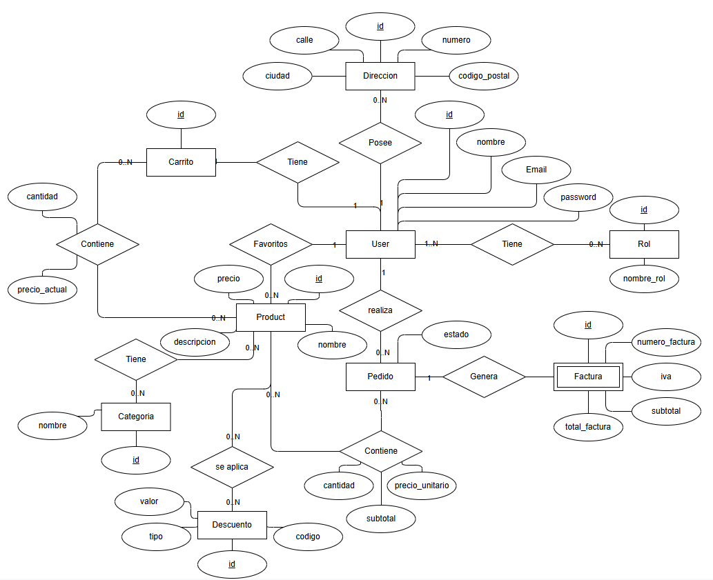
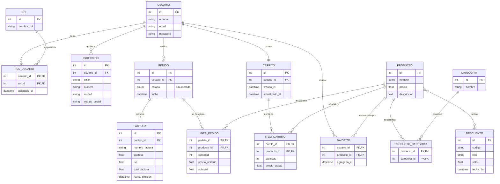

# Documentación del Proyecto: NexusGear

## 1. Introducción y Concepto
Este proyecto consiste en el desarrollo de un e-commerce especializado en productos tecnológicos ergonómicos, enfocado principalmente en los sectores de gaming y oficina. El catálogo se centra en periféricos que mejoran la salud postural, como ratones verticales, teclados mecánicos compactos (60%) y reposamuñecas.

## 2. Objetivos del Proyecto
El desarrollo se fundamenta en los siguientes pilares:
* **Frameworks:** Uso robusto de **Laravel** para el backend y **Bootstrap 5** para un diseño responsive y personalizado.
* **Funcionalidad:** Implementación de operaciones CRUD completas, sistema de autenticación (Login-Signin) y panel de administración.
* **Identidad de Marca:** Creación de una imagen coherente basada en la psicología del color según las directrices académicas.
* **Comunicación:** Configuración de protocolo SMTP para recuperación de contraseñas y notificaciones de pedidos.

## 3. Identidad Visual y Diseño (UI/UX)

Siguiendo las directrices del proyecto, se ha establecido el **Verde Agua** como color primario de la plataforma. Esta elección es perfecta ya que responde a la psicología del color aplicada a nuestro nicho:

* **Psicología del Color:** El Verde Agua transmite calma, frescura y equilibrio. En un entorno de periféricos ergonómicos, este color refuerza la idea de bienestar, salud postural y reducción del estrés durante largas jornadas de trabajo o gaming.
* **Aplicación en Bootstrap 5:** Se realizará una personalización de las variables de Sass de Bootstrap para sobrescribir el color `$primary`. Esto afectará a:
    * Botones de acción principal (CTA) como "Añadir al carrito" o "Tramitar pedido".
    * Elementos de navegación y encabezados para mantener la coherencia de marca.
    * Notificaciones visuales de éxito tras realizar una compra.
* **Diseño Responsive:** El uso de este color se integrará en un diseño fuertemente personalizado que garantice la legibilidad y accesibilidad en dispositivos móviles y escritorio.

### 3.1 Guía de Estilo Técnica (Paleta de Colores)
Para garantizar la coherencia visual en el desarrollo del frontend y el panel de administración, se utilizarán los siguientes códigos cromáticos:

| Uso | Muestra | Nombre | Código HEX |
| :--- | :--- | :--- | :--- |
| **Color Primario (Asignado)** | $${\color{#45B39D}▉}$$ | Verde Agua Base | `#45B39D` |
| **Variación Clara** | $${\color{#A2D9CE}▉}$$ | Verde Agua Suave | `#A2D9CE` |
| **Variación Oscura** | $${\color{#117864}▉}$$ | Verde Agua Profundo | `#117864` |
| **Fondo de Interfaz** | $${\color{#F8F9FA}▉}$$ | Gris Neutro (Light) | `#F8F9FA` |
| **Texto y Títulos** | $${\color{#2C3E50}▉}$$ | Azul Medianoche | `#2C3E50` |
| **Acción Secundaria** | $${\color{#E67E22}▉}$$ | Naranja Alerta | `#E67E22` |

## 4. Análisis de Requisitos (v1.0)

### 4.1 Requisitos Funcionales
* **Navegación:** Soporte para usuarios no registrados en el catálogo.
* **Autenticación:** Registro obligatorio únicamente para tramitar pedidos o gestionar la lista de favoritos.
* **Roles:** Separación estricta entre usuarios estándar y administradores.
* **Gestión de Pedidos:** Los usuarios registrados pueden realizar compras, revisar el estado de sus pedidos y recibir confirmaciones por correo electrónico.
* **Administración:** CRUD completo del catálogo y monitorización de pedidos de clientes.

### 4.2 Requisitos No Funcionales y Técnicos
* **Arquitectura:** Diseño previo de base de datos cumpliendo con cardinalidades 1:1, 1:N y N:M.
* **Base de Datos Avanzada:** Uso de seeders, vistas SQL y control de transacciones.
* **Versionado y Gestión:** Código alojado en **GitHub** y gestión de tareas mediante tableros **Kanban**.

---

## 5. Diseño de la Base de Datos
Este proyecto utiliza un modelo de base de datos relacional para gestionar usuarios, productos, carritos y pedidos. A continuación se presentan las dos representaciones del diseño.

### 5.1. Modelo Entidad-Relación (Notación de Chen)
Este diagrama representa la lógica de negocio y las relaciones conceptuales entre los elementos del sistema. Es ideal para entender el flujo de datos sin entrar en detalles técnicos de implementación.

* **Entidades Fuertes:** Usuario, Producto, Categoría, Rol, Dirección, Carrito, Pedido, Descuento.
* **Entidades Débiles:** Factura (depende de Pedido).
* **Atributos Multivalorados/Derivados:** El estado del pedido se maneja mediante un ENUM.

---

### 5.2. Diagrama de Implementación (Mermaid - Crow's Foot)
El siguiente diagrama muestra la estructura física de las tablas, incluyendo las llaves primarias (PK), foráneas (FK) y las tablas intermedias para relaciones N:M.

---

## 6. Decisiones de Diseño y Ajustes (Post-Revisión)
Tras la revisión con el profesorado, se han integrado las siguientes reglas de negocio y correcciones técnicas:

* **Ciclo de Vida del Carrito:** El carrito se vincula automáticamente en el momento de la creación del usuario.
* **Integridad de Datos:** Las tablas intermedias utilizan una fusión de claves primarias como identificador único.
* **Gestión de Pedidos:** El campo `estado` en la tabla `Pedido` se implementa como un tipo **enumerado** directamente, sin tablas adicionales.
* **Detalle de Facturación:** La factura debe desglosar obligatoriamente el IVA y los subtotales.
* **Localización:** Implementación de idiomas mediante variables en ficheros específicos.
* **Exclusiones Técnicas:** Se ha descartado el uso de `log_transaction` para evitar la dependencia de Redis.

