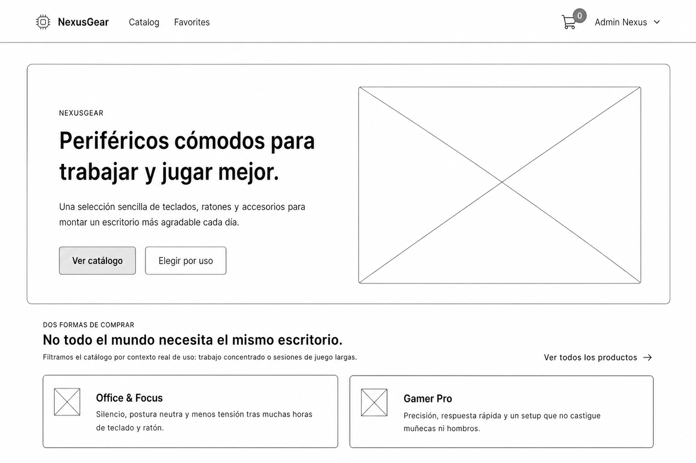
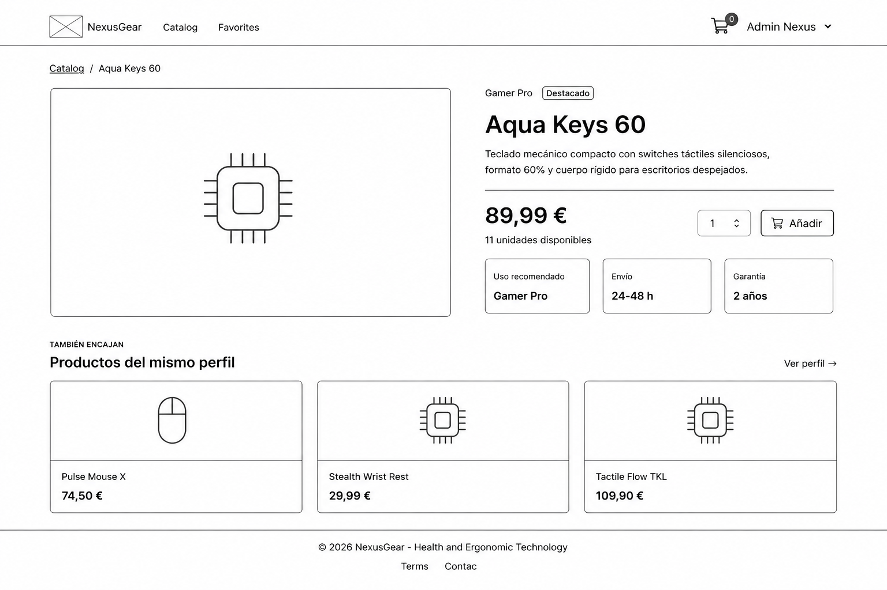
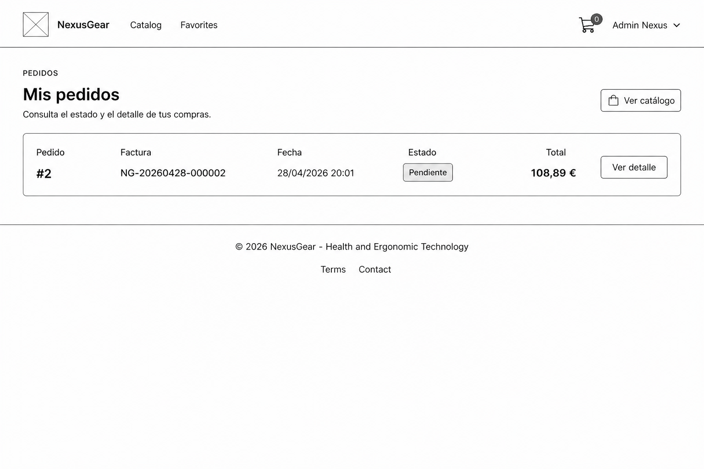
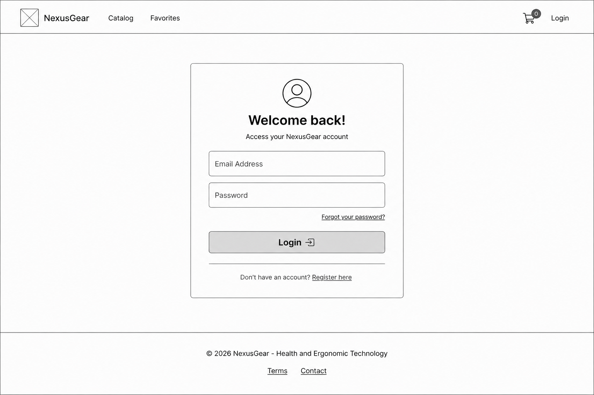
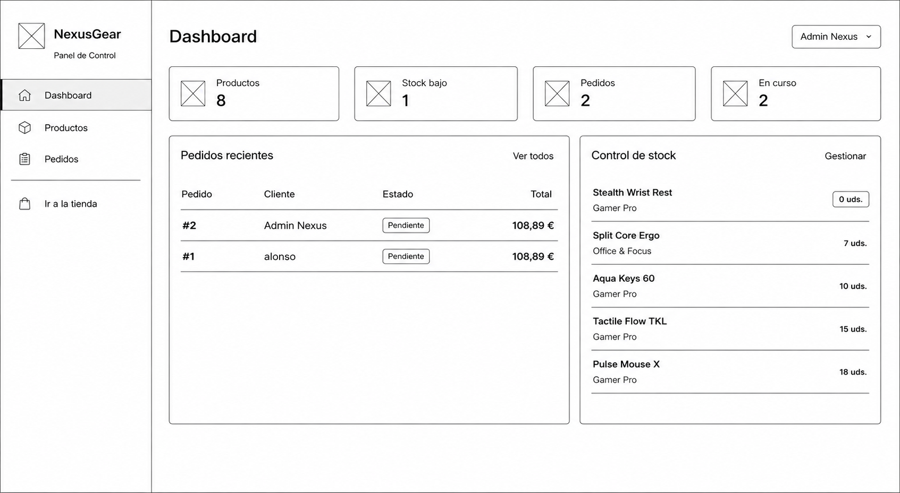
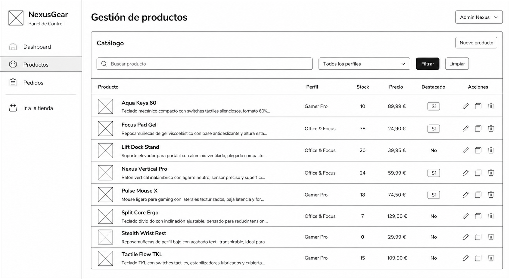
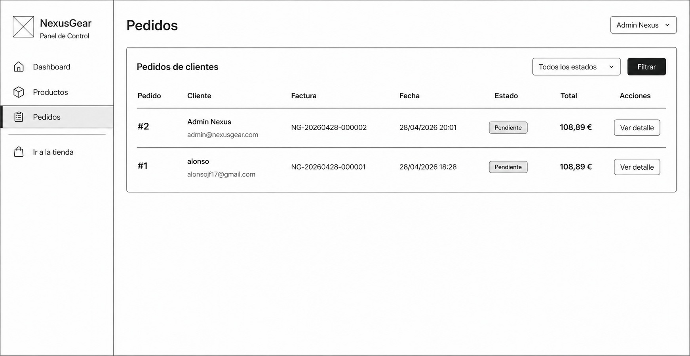
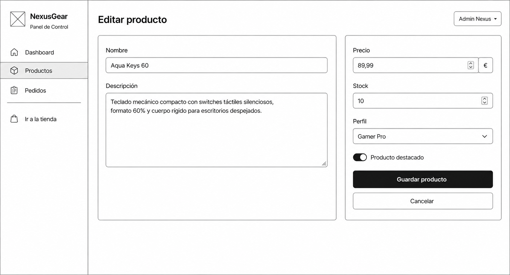
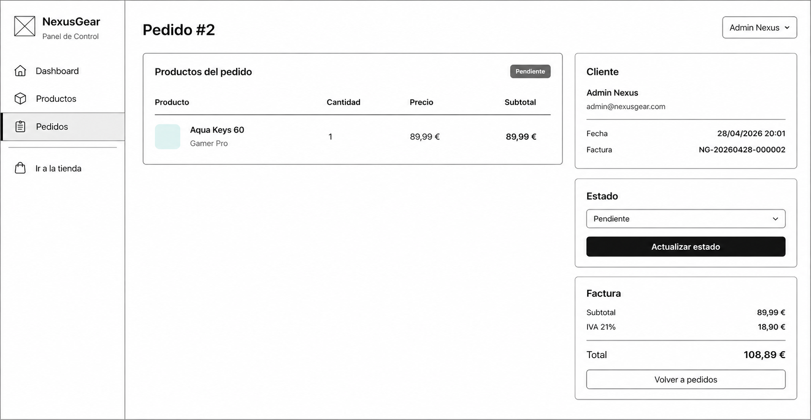
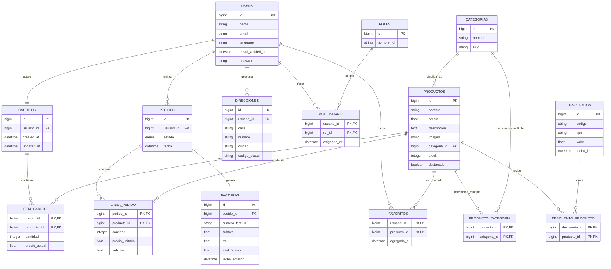

# Documentación del Proyecto: NexusGear

## 1. Introducción y Concepto

NexusGear es un comercio electrónico desarrollado con Laravel para la venta de periféricos tecnológicos ergonómicos. La tienda está orientada a dos perfiles principales de usuario:

- **Office & Focus:** usuarios que buscan comodidad, productividad y salud postural durante largas jornadas de trabajo.
- **Gamer Pro:** usuarios que buscan periféricos de alto rendimiento sin renunciar a la ergonomía.

El catálogo incluye productos como ratones verticales, teclados compactos, reposamuñecas y soportes para portátiles. La versión 1.0 se centra en el caso de uso principal pedido en la EPD 3: permitir que un usuario registrado compre productos, consulte sus pedidos y reciba confirmación por correo, mientras que el administrador puede gestionar productos y pedidos.

## 2. Objetivos del Proyecto

El desarrollo se fundamenta en los siguientes pilares:

- **Frameworks:** uso de **Laravel 12**, **Eloquent ORM**, **Blade**, **Vite + SASS** y **Bootstrap 5**.
- **Funcionalidad:** implementación del caso principal de compra, operaciones CRUD de productos, carrito, pedidos y panel de administración.
- **Autenticación:** sistema completo de registro, inicio de sesión, verificación de correo y recuperación de contraseña mediante **Laravel Fortify**.
- **Identidad de marca:** diseño visual propio basado en la psicología del color asignado al grupo.
- **Comunicación:** configuración SMTP para recuperación de contraseñas y confirmación de pedidos.
- **Persistencia:** diseño relacional con relaciones 1:1, 1:N y N:M, seeders y control transaccional en el checkout.
- **Gestión del proyecto:** uso de Git, GitHub y tablero Kanban para organizar el trabajo.

Repositorio público: <https://github.com/Parritoso/Laravel>

## 3. Identidad Visual y Diseño (UI/UX)

Siguiendo las directrices del proyecto, se ha establecido el **verde agua** como color primario de la plataforma. Esta elección encaja con la temática ergonómica porque transmite calma, equilibrio, frescura y bienestar, valores relacionados con la reducción de fatiga en contextos de trabajo y juego prolongado.

- **Psicología del color:** el verde agua refuerza la idea de salud postural, comodidad y tecnología no agresiva.
- **Aplicación en Bootstrap 5:** se personaliza la variable `$primary` en SASS para que botones, enlaces, badges, navegación y estados visuales mantengan coherencia de marca.
- **Diseño responsive:** las vistas públicas y de administración están construidas con Bootstrap 5 y componentes propios, adaptadas a escritorio y móvil.

### 3.1 Guía de Estilo Técnica (Paleta de Colores)

| Uso | Nombre | Código HEX |
| :--- | :--- | :--- |
| **Color primario real en SASS** | Verde agua | `#4FD1C5` |
| **Variación oscura / precio** | Verde profundo | `#117864` |
| **Texto principal / panel admin** | Dark Gear | `#2D3748` |
| **Fondo de interfaz** | Gris claro | `#F8FAFC` |
| **Superficies** | Blanco | `#FFFFFF` |

### 3.2 Mockups de la Aplicación

Los mockups se encuentran en la carpeta `docs/` y sirven como referencia visual del flujo público, el flujo de usuario autenticado y el panel de administración. Se plantean con una composición limpia, navegación superior en la tienda pública, sidebar en administración y componentes de formulario/listado coherentes con Bootstrap 5.

<details>
<summary>Mockups de tienda y usuario</summary>

**Página principal**



**Catálogo de productos**


**Detalle de producto**



**Historial de pedidos del usuario**



**Inicio de sesión**



</details>

<details>
<summary>Mockups del panel de administración</summary>

**Dashboard de administración**



**Gestión de productos**



**Listado de pedidos**



**Formulario de edición de producto**



**Detalle de pedido**



</details>

## 4. Análisis de Requisitos (v1.0)

### 4.1 Requisitos Funcionales

- El catálogo de productos debe ser público para usuarios no registrados.
- El sistema debe permitir buscar productos por nombre o descripción, filtrarlos por perfil/categoría principal y ordenarlos por precio o nombre.
- El usuario debe poder registrarse, iniciar sesión, cerrar sesión, verificar su correo y recuperar la contraseña.
- El usuario registrado y verificado debe poder añadir productos al carrito, modificar cantidades, eliminar líneas y vaciar el carrito.
- El checkout debe validar stock, crear el pedido, descontar inventario, generar factura y vaciar el carrito.
- El usuario debe poder consultar el historial de pedidos y el detalle de cada pedido propio.
- El usuario debe recibir un correo de confirmación tras completar una compra.
- El administrador debe poder crear, editar, listar y eliminar productos.
- El administrador debe poder consultar todos los pedidos y actualizar su estado.
- Un usuario estándar no debe poder acceder a rutas de administración.

### 4.2 Requisitos No Funcionales y Técnicos

- Uso obligatorio de Bootstrap 5 para interfaces responsive.
- Arquitectura de base de datos diseñada previamente con cardinalidades 1:1, 1:N y N:M.
- Uso de migraciones, modelos Eloquent y seeders.
- Checkout protegido mediante transacción de base de datos y bloqueo de productos durante la actualización de stock.
- Código gestionado con Git y alojado en GitHub.
- Proyecto funcional sin pasarela de pago real.
- Configuración SMTP mediante variables de entorno.

## 5. Diseño de la Base de Datos

El proyecto utiliza un modelo relacional para usuarios, roles, catálogo, carritos, pedidos, facturas, direcciones, favoritos, categorías y descuentos.

### 5.1. Modelo Entidad-Relación (Notación de Chen)

El diagrama conceptual se encuentra en:


Entidades principales:

- **Usuario:** cuenta registrada en el sistema.
- **Rol:** define permisos de administración o cliente.
- **Producto:** artículo vendible del catálogo.
- **Categoría:** clasificación del producto. En la versión actual funciona como perfil principal (`Office & Focus` o `Gamer Pro`).
- **Carrito:** carrito activo del usuario.
- **Pedido:** compra realizada por un usuario.
- **Factura:** documento asociado a un pedido.
- **Dirección:** direcciones de envío previstas para el perfil de usuario.
- **Favorito:** relación entre usuarios y productos guardados.
- **Descuento:** cupón o rebaja aplicable a productos.

### 5.2. Diagrama de Implementación (Mermaid - Crow's Foot)

El siguiente diagrama refleja el esquema físico actual. La relación activa entre producto y categoría en v1.0 se realiza mediante `productos.categoria_id`. Además, el esquema incluye la tabla `producto_categoria` para contemplar asociaciones múltiples de categorías en ampliaciones posteriores.



### 5.3 Cardinalidades Cubiertas

- **1:1:** `users` ↔ `carritos`.
- **1:1:** `pedidos` ↔ `facturas`.
- **1:N:** `users` → `pedidos`.
- **1:N:** `users` → `direcciones`.
- **1:N:** `categorias` → `productos` en la implementación activa de v1.0.
- **1:N:** `carritos` → `item_carrito`.
- **1:N:** `pedidos` → `linea_pedido`.
- **N:M:** `users` ↔ `roles` mediante `rol_usuario`.
- **N:M:** `users` ↔ `productos` mediante `favoritos`.
- **N:M:** `productos` ↔ `descuentos` mediante `descuento_producto`.
- **N:M:** `productos` ↔ `categorias` mediante `producto_categoria` como estructura disponible para asociación múltiple.

## 6. Decisiones de Diseño y Ajustes

- **Precio congelado:** `item_carrito.precio_actual` y `linea_pedido.precio_unitario` guardan el precio en el momento de la operación.
- **Checkout transaccional:** el proceso de compra usa `DB::transaction()` para crear pedido, líneas, factura, descontar stock y vaciar carrito como una única operación.
- **Bloqueo de stock:** durante el checkout se usa `lockForUpdate()` sobre cada producto para evitar inconsistencias de inventario.
- **Factura única:** cada pedido genera una factura con número `NG-YYYYMMDD-ID`, subtotal, IVA del 21% y total.
- **Carrito por usuario:** se crea automáticamente o bajo demanda mediante `firstOrCreate()`.
- **Roles:** el middleware `admin` evita que usuarios estándar entren en el panel de administración.
- **Formato monetario:** los modelos exponen accessors para mostrar precios con formato europeo.
- **Categoría/perfil:** en v1.0 el campo `categoria_id` sustituye al antiguo campo `perfil`; las categorías sembradas son `office` y `gamer`.
- **Internacionalización inicial:** existen ficheros de idioma para español, inglés, portugués y japonés en varias vistas.
- **Descuentos:** existe CRUD de descuentos en administración y asignación opcional a productos, aunque no forma parte del alcance mínimo de v1.0.

## 7. Casos de Uso

### CU-01: Navegar por el catálogo

- **Actor:** visitante o usuario registrado.
- **Precondición:** ninguna.
- **Flujo principal:**
  1. El actor accede a la página de productos.
  2. El sistema muestra productos con nombre, descripción, precio, stock y categoría/perfil.
  3. El actor puede buscar por nombre o descripción.
  4. El actor puede filtrar por `Office & Focus` o `Gamer Pro`.
  5. El actor puede ordenar por destacados, precio o nombre.
  6. El actor puede abrir el detalle de un producto.

### CU-02: Registrarse e iniciar sesión

- **Actor:** visitante.
- **Precondición:** no tiene sesión iniciada.
- **Flujo principal:**
  1. El visitante accede al formulario de registro o login.
  2. El sistema valida los datos mediante Fortify.
  3. Al registrarse, se crea la cuenta y se envía verificación de correo.
  4. Tras verificar el correo, el usuario queda habilitado para rutas protegidas.

### CU-03: Gestionar carrito

- **Actor:** usuario registrado y verificado.
- **Precondición:** sesión iniciada.
- **Flujo principal:**
  1. El usuario añade un producto disponible al carrito.
  2. El sistema comprueba el stock.
  3. El usuario modifica cantidades, elimina productos o vacía el carrito.
  4. El carrito muestra subtotales y total actualizado.
- **Flujo alternativo:** si la cantidad supera el stock, el sistema rechaza la operación y muestra un aviso.

### CU-04: Realizar compra

- **Actor:** usuario registrado y verificado.
- **Precondición:** carrito con al menos un producto.
- **Flujo principal:**
  1. El usuario revisa su carrito.
  2. Pulsa finalizar compra.
  3. El sistema valida stock dentro de una transacción.
  4. El sistema crea pedido, líneas de pedido y factura.
  5. El sistema descuenta stock y vacía el carrito.
  6. El usuario recibe correo de confirmación.
  7. El usuario es redirigido al detalle del pedido.
- **Flujo alternativo:** si algún producto no tiene stock suficiente, no se crea pedido y el carrito permanece intacto.

### CU-05: Consultar pedidos

- **Actor:** usuario registrado y verificado.
- **Precondición:** sesión iniciada.
- **Flujo principal:**
  1. El usuario accede a sus pedidos.
  2. El sistema lista sus pedidos ordenados por fecha.
  3. El usuario abre un pedido.
  4. El sistema muestra productos, cantidades, precios, estado y factura.
- **Restricción:** un usuario no puede ver pedidos de otro usuario.

### CU-06: Administrar productos

- **Actor:** administrador.
- **Precondición:** sesión iniciada con rol `admin`.
- **Flujo principal:**
  1. El administrador accede al panel.
  2. Lista productos con filtros.
  3. Crea productos indicando nombre, descripción, precio, stock, categoría/perfil, destacado y descuento opcional.
  4. Edita productos existentes.
  5. Elimina productos que no aparezcan en pedidos.

### CU-07: Administrar pedidos

- **Actor:** administrador.
- **Precondición:** sesión iniciada con rol `admin`.
- **Flujo principal:**
  1. El administrador accede al listado de pedidos.
  2. Filtra por estado.
  3. Abre el detalle de un pedido.
  4. Actualiza el estado entre `pendiente`, `procesando`, `enviado`, `entregado` y `cancelado`.

### CU-08: Recuperar contraseña

- **Actor:** usuario registrado.
- **Precondición:** el usuario no recuerda su contraseña.
- **Flujo principal:**
  1. El usuario solicita recuperación desde el formulario.
  2. Fortify envía un correo con enlace de restablecimiento.
  3. El usuario define una nueva contraseña.
  4. Puede volver a iniciar sesión.

## 8. Estructura del Código

La aplicación Laravel se encuentra en la carpeta `NexusGear/`.

### 8.1 Controladores Principales

- `app/Http/Controllers/ProductController.php`: catálogo público, búsqueda, filtro y detalle de producto.
- `app/Http/Controllers/CartController.php`: alta, actualización, eliminación y vaciado del carrito.
- `app/Http/Controllers/OrderController.php`: checkout, historial y detalle de pedidos del usuario.
- `app/Http/Controllers/Admin/ProductController.php`: CRUD de productos para administración.
- `app/Http/Controllers/Admin/OrderController.php`: gestión de pedidos en administración.
- `app/Http/Controllers/Admin/CategoriaController.php`: CRUD de categorías.
- `app/Http/Controllers/Admin/DiscountController.php`: CRUD de descuentos.
- `app/Http/Controllers/OnboardingController.php`: selección inicial de idioma y preferencias tras verificar correo.

### 8.2 Modelos

- `User`: autenticación, roles, carrito, pedidos, direcciones y favoritos.
- `Producto`: catálogo, categoría principal, descuentos, favoritos, carrito y líneas de pedido.
- `Categoria`: categorías/perfiles del catálogo.
- `Carrito` e `ItemCarrito`: carrito y líneas.
- `Pedido` y `LineaPedido`: pedidos y detalle de compra.
- `Factura`: factura asociada a pedido.
- `Rol` y `RolUsuario`: roles y tabla pivote.
- `Direccion`: direcciones de envío previstas para el perfil.
- `Favorito`: tabla pivote de favoritos.
- `Descuento` y `DescuentoProducto`: descuentos y asignación a productos.

### 8.3 Vistas

- `resources/views/home.blade.php`: página principal.
- `resources/views/products/*.blade.php`: catálogo y detalle.
- `resources/views/cart/index.blade.php`: carrito.
- `resources/views/orders/*.blade.php`: pedidos del usuario.
- `resources/views/admin/*.blade.php`: panel de administración.
- `resources/views/auth/*.blade.php`: vistas de Fortify.
- `resources/views/emails/orders/confirmation.blade.php`: correo de confirmación de pedido.

### 8.4 Middleware

- `CheckAdmin`: controla el acceso al panel de administración.
- `SetLocale`: aplica el idioma del usuario cuando está disponible.

## 9. Rutas del Sistema

### 9.1 Rutas Públicas

| Método | URI | Descripción |
| :--- | :--- | :--- |
| GET | `/` | Página principal |
| GET | `/productos` | Catálogo público |
| GET | `/productos/{producto}` | Detalle de producto |
| GET/POST | `/login` | Inicio de sesión |
| GET/POST | `/register` | Registro |
| GET/POST | `/forgot-password` | Recuperación de contraseña |
| GET/POST | `/reset-password` | Restablecimiento de contraseña |
| GET | `/email/verify` | Aviso de verificación de correo |

### 9.2 Rutas de Usuario Autenticado y Verificado

| Método | URI | Descripción |
| :--- | :--- | :--- |
| GET | `/home` | Redirección según rol |
| GET | `/carrito` | Ver carrito |
| POST | `/carrito/productos/{producto}` | Añadir producto |
| PATCH | `/carrito/productos/{producto}` | Actualizar cantidad |
| DELETE | `/carrito/productos/{producto}` | Eliminar línea |
| DELETE | `/carrito` | Vaciar carrito |
| POST | `/checkout` | Finalizar compra |
| GET | `/pedidos` | Historial de pedidos |
| GET | `/pedidos/{pedido}` | Detalle de pedido |
| GET/POST | `/onboarding` | Configuración inicial |

### 9.3 Rutas de Administración

Todas usan middleware `auth`, `verified` y `admin`.

| Método | URI | Descripción |
| :--- | :--- | :--- |
| GET | `/admin/dashboard` | Dashboard |
| RESOURCE | `/admin/products` | CRUD de productos |
| RESOURCE | `/admin/categorias` | CRUD de categorías |
| RESOURCE | `/admin/discounts` | CRUD de descuentos |
| GET | `/admin/orders` | Listado de pedidos |
| GET | `/admin/orders/{pedido}` | Detalle de pedido |
| PATCH | `/admin/orders/{pedido}` | Actualizar estado |

## 10. Seeders y Datos Iniciales

El entorno se puede poblar con:

```bash
php artisan migrate:fresh --seed
```

Seeders ejecutados:

1. `RolSeeder`: crea los roles `admin` y `customer`.
2. `CategoriaSeeder`: crea `Office & Focus` (`office`) y `Gamer Pro` (`gamer`).
3. `ProductSeeder`: crea productos iniciales.
4. `UserSeeder`: crea usuarios iniciales.

Credenciales iniciales:

| Rol | Email | Contraseña |
| :--- | :--- | :--- |
| Admin | `admin@nexusgear.com` | `admin123` |
| Cliente | `juan@example.com` | `user123` |

Productos iniciales:

- Nexus Vertical Pro
- Aqua Keys 60
- Focus Pad Gel
- Split Core Ergo
- Pulse Mouse X
- Lift Dock Stand
- Stealth Wrist Rest
- Tactile Flow TKL

## 11. Configuración e Instalación

Requisitos:

- PHP `^8.2`
- Composer
- Node.js y npm
- MySQL o SQLite

Instalación básica:

```bash
cd NexusGear
composer install
npm install
cp .env.example .env
php artisan key:generate
php artisan migrate:fresh --seed
npm run build
php artisan serve
```

Durante desarrollo:

```bash
npm run dev
```

## 12. Configuración SMTP y Correo

La aplicación usa Laravel Mail para:

- Verificación de correo.
- Recuperación de contraseña.
- Confirmación de pedido mediante `OrderConfirmationMail`.

Variables principales en `.env`:

```env
MAIL_MAILER=smtp
MAIL_HOST=sandbox.smtp.mailtrap.io
MAIL_PORT=2525
MAIL_USERNAME=usuario_mailtrap
MAIL_PASSWORD=password_mailtrap
MAIL_ENCRYPTION=tls
MAIL_FROM_ADDRESS=noreply@nexusgear.com
MAIL_FROM_NAME="NexusGear"
```

El correo de pedido se envía después de confirmar la transacción del checkout y usa la plantilla `resources/views/emails/orders/confirmation.blade.php`.

## 13. Alcance de la Entrega 1.0

| Bloque | Estado | Observaciones |
| :--- | :--- | :--- |
| Catálogo público | Completado | Búsqueda, filtro por perfil/categoría principal, ordenación y detalle |
| Autenticación Fortify | Completado | Registro, login, logout, verificación y recuperación |
| Carrito | Completado | Añadir, modificar, eliminar, vaciar y validar stock |
| Checkout | Completado | Transacción, factura, stock y correo |
| Pedidos de usuario | Completado | Historial y detalle protegido |
| Admin productos | Completado | CRUD con categoría principal y descuento opcional |
| Admin pedidos | Completado | Listado, detalle y cambio de estado |
| Admin categorías | Implementado | CRUD disponible y categorías integradas en productos |
| Admin descuentos | Implementado | CRUD y asignación opcional a productos |
| Internacionalización base | Implementado | Middleware de idioma y ficheros de traducción iniciales |
| Onboarding | Implementado | Selección inicial de idioma y preferencias |
| Imágenes de producto | Implementado | Campo `imagen` y recurso por defecto en almacenamiento público |
