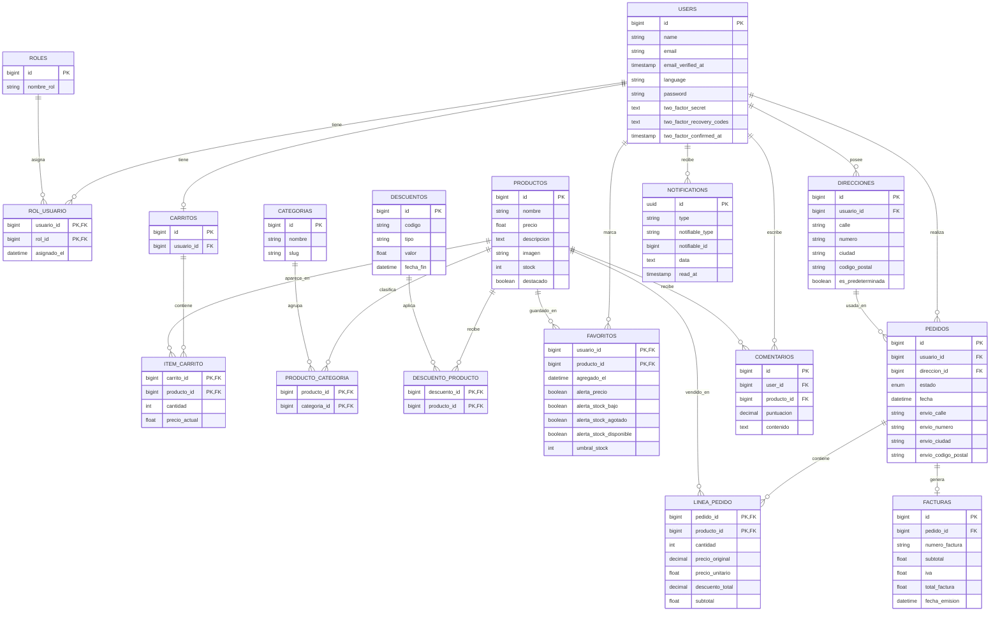

# NexusGear

**Comercio electronico de perifericos ergonomicos**

**Autores:** Alonso Jimenez Flores, Daniel Valladolid Moreno y Javier Sanchez Claro  
**Fecha:** Junio de 2026

# Resumen

NexusGear es una aplicacion web de comercio electronico orientada a la venta de perifericos tecnologicos ergonomicos. El proyecto desarrolla una experiencia completa de tienda online: catalogo publico, registro e inicio de sesion, carrito, favoritos, direcciones, comentarios, compra, pedidos, facturas, notificaciones y panel de administracion.

La aplicacion busca resolver un problema habitual en la compra de tecnologia: la dificultad para encontrar productos adecuados entre muchas opciones, con informacion dispersa, cambios de stock, descuentos y preferencias personales. Para ello, NexusGear organiza el catalogo por categorias y perfiles de uso, permite guardar productos de interes y ofrece una configuracion inicial que ayuda a adaptar la experiencia desde el primer acceso.

Ademas del flujo principal de compra, la entrega final incorpora pagos en modo test, despliegue reproducible con Docker, uso de Redis para cache, sesiones y cola de trabajos, y MongoDB para registros no relacionales de busquedas, auditoria administrativa y errores. La solucion queda desplegada publicamente en `https://nexusgear.duckdns.org` y mantiene un entorno local reproducible para pruebas y defensa.

# Abstract

NexusGear is a web-based e-commerce application focused on ergonomic technology peripherals. The project implements a complete online store experience: public catalogue, user registration and login, cart, favourites, addresses, comments, checkout, orders, invoices, notifications and an administration panel.

The application addresses a common issue in technology shopping: users often face too many product options, changing stock, discounts and personal preferences that are not reflected early enough in the buying process. NexusGear structures the catalogue around categories and usage profiles, allows users to save products of interest and includes an onboarding flow to adapt the experience from the beginning.

In addition to the main purchasing workflow, the final version includes test payments, a reproducible Docker-based environment, Redis for cache, sessions and queues, and MongoDB for non-relational search logs, administrative audit records and error tracking. The application is publicly deployed at `https://nexusgear.duckdns.org` and keeps a local environment ready for validation and demonstration.

# 1. Introduccion y contexto

## 1.1 Descripcion general

NexusGear parte de la necesidad de tecnologías para distintos usuarios construir un comercio electronico realista con Laravel, Bootstrap 5, autenticacion, panel de administracion, base de datos relacional, uso de correo mediante SMTP y documentacion tecnica progresiva.

La tematica elegida es la venta de perifericos ergonomicos para personas que pasan muchas horas frente al ordenador. La aplicacion se dirige principalmente a dos perfiles:

- **Office & Focus**: usuarios que priorizan comodidad, productividad y salud postural durante jornadas largas de trabajo.
- **Gamer Pro**: usuarios que buscan perifericos de alto rendimiento sin renunciar a la ergonomia.

La entrega final desarrolla el flujo de una tienda funcional: catalogo publico, carrito para visitantes y usuarios, registro, verificacion de correo, checkout con pago en modo test, pedidos, factura, confirmacion por correo, favoritos, comentarios, notificaciones y administracion separada mediante roles.

## 1.2 Motivacion

La motivacion principal del proyecto es unir experiencia de usuario e integridad de datos en una tienda online realista. En un comercio electronico no basta con mostrar productos: el sistema debe evitar stock negativo, impedir que un usuario consulte pedidos ajenos, conservar precios historicos aunque cambie el catalogo y ofrecer mensajes claros en los momentos criticos.

NexusGear tambien introduce una capa de personalizacion inicial. El onboarding permite conocer preferencias basicas del usuario desde el principio. Esta informacion, junto con busquedas, favoritos y comportamiento de compra, abre la puerta a mejoras futuras de recomendaciones, marketing, comunicaciones mas ajustadas al perfil del cliente y filtros preaplicados por defecto.

## 1.3 Tecnologias principales

| Tecnologia      | Uso en el proyecto                                                                                     |
| --------------- | ------------------------------------------------------------------------------------------------------ |
| Laravel 12      | Framework principal, rutas, controladores, modelos, migraciones y servicios.                           |
| Laravel Fortify | Registro, login, verificacion de correo, recuperacion de contrasena, confirmacion de contrasena y 2FA. |
| Eloquent ORM    | Relaciones, consultas, accessors, scopes y persistencia relacional.                                    |
| Blade           | Plantillas del sitio publico, area privada, administracion y correos.                                  |
| Bootstrap 5     | Base responsive de la interfaz, formularios, navbar, botones y componentes.                            |
| Vite + SASS     | Compilacion de estilos propios y assets frontend.                                                      |
| MySQL           | Base de datos relacional principal en Docker y despliegue.                                             |
| SQLite          | Base de datos en memoria para pruebas automatizadas.                                                   |
| Redis / Predis  | Cache, sesiones y cola de trabajos en Docker y VPS.                                                    |
| MongoDB         | Logs de busqueda, auditoria administrativa y errores.                                                  |
| Stripe          | Pasarela de pago en modo test mediante Stripe Checkout.                                                |
| Docker Compose  | Entorno reproducible con PHP-FPM, Nginx, Vite, MySQL, Redis, MongoDB, Mailpit y worker.                |
| SMTP / Mailpit  | Correos de verificacion, recuperacion, confirmacion de pedido y alertas.                               |
| PHPUnit         | Pruebas de integracion sobre catalogo, carrito, checkout, admin y favoritos.                           |
| GitHub Actions  | Ejecucion automatizada de tests en varias versiones de PHP.                                            |

# 2. Objetivos y requisitos

## 2.1 Objetivo general

Desarrollar un comercio electronico funcional y defendible, con una arquitectura Laravel mantenible, una base de datos coherente, control de acceso por roles, operaciones criticas protegidas y documentacion alineada con la implementacion real.

## 2.2 Objetivos especificos

- Implementar un catalogo publico con busqueda, filtros, ordenacion, categorias y ficha de producto.
- Permitir registro, login, logout, verificacion de correo, recuperacion de contrasena y autenticacion en dos factores.
- Gestionar carrito para visitantes y usuarios, con fusion de carrito invitado tras login.
- Completar el flujo de compra con direccion, pago en modo test, pedido, lineas, factura, descuento de inventario y correo.
- Separar funcionalidades de cliente y administrador mediante roles, middleware y rutas protegidas.
- Permitir al administrador gestionar productos, categorias, descuentos y pedidos.
- Incorporar perfil de usuario, direcciones, cambio de contrasena, idioma, favoritos y comentarios.
- Generar alertas de favoritos por bajada de precio, falta de stock, reposicion y umbral de stock bajo.
- Registrar eventos no relacionales en MongoDB para busquedas, auditoria y errores.
- Usar Redis como soporte de cache, sesiones y cola de trabajos.
- Proporcionar una instalacion reproducible con Docker Compose.
- Desplegar la aplicacion en una URL publica con HTTPS.
- Mantener el proyecto bajo Git y GitHub, con ramas, issues, tags y automatizacion de pruebas.

## 2.3 Requisitos funcionales

La siguiente tabla consolida los requisitos descritos en el README y los requisitos incorporados durante la entrega final, de forma que ambas fuentes documenten el mismo alcance funcional.

| Codigo | Requisito                                                                                                                              |
| ------ | -------------------------------------------------------------------------------------------------------------------------------------- |
| RF-01  | El catalogo debe ser accesible para visitantes sin iniciar sesion.                                                                     |
| RF-02  | El usuario puede buscar productos por texto y filtrarlos por categorias, disponibilidad, precio y ofertas.                             |
| RF-03  | El sistema permite registro, login, logout, verificacion de correo y recuperacion de contrasena.                                       |
| RF-04  | El usuario puede configurar 2FA y completar un onboarding inicial de idioma, direccion y preferencias.                                 |
| RF-05  | El usuario puede anadir productos al carrito, modificar cantidades, eliminar lineas y vaciarlo.                                        |
| RF-06  | El carrito invitado se conserva en cookie y se fusiona con el carrito del usuario al iniciar sesion.                                   |
| RF-07  | El checkout valida carrito y stock, crea pedido pendiente, abre sesion Stripe y completa factura, stock y correo tras pago confirmado. |
| RF-08  | El usuario puede consultar sus pedidos, pero no pedidos de otros usuarios.                                                             |
| RF-09  | El administrador puede crear, editar, listar y eliminar productos cuando las reglas de integridad lo permitan.                         |
| RF-10  | El administrador puede gestionar categorias y asociarlas a productos mediante relacion N:M.                                            |
| RF-11  | El administrador puede gestionar descuentos y asignarlos a productos.                                                                  |
| RF-12  | El usuario puede gestionar perfil, idioma, direcciones y contrasena desde su area privada.                                             |
| RF-13  | El usuario puede marcar productos como favoritos y configurar alertas asociadas.                                                       |
| RF-14  | El usuario puede publicar comentarios y valoraciones sobre productos.                                                                  |
| RF-15  | El sistema avisa al usuario de cambios relevantes en productos favoritos por correo y notificacion web.                                |
| RF-16  | El panel de administracion muestra metricas utiles a partir de consultas y vistas SQL.                                                 |
| RF-17  | La aplicacion esta internacionalizada en espanol, ingles, portugues y japones.                                                         |
| RF-18  | El sistema registra busquedas, auditoria administrativa y errores en MongoDB.                                                          |
| RF-19  | El sistema se puede ejecutar con Docker, incluyendo MySQL, Redis, MongoDB, Mailpit, Nginx, Vite y worker.                              |
| RF-20  | El administrador puede consultar todos los pedidos y actualizar su estado desde el panel de administracion.                            |
| RF-21  | El sistema envia correos transaccionales de verificacion, recuperacion, confirmacion de pedido y alertas cuando corresponde.            |

## 2.4 Requisitos no funcionales

| Codigo | Requisito                                                                                                                                              |
| ------ | ------------------------------------------------------------------------------------------------------------------------------------------------------ |
| RNF-01 | La interfaz debe ser responsive y coherente en pantallas publicas, privadas y de administracion, usando Bootstrap 5 como base visual.                  |
| RNF-02 | La autenticacion debe proteger contrasenas, sesiones, verificacion de correo, recuperacion de contrasena y rutas privadas mediante mecanismos Laravel. |
| RNF-03 | El acceso a administracion debe controlarse mediante roles y middleware, impidiendo que usuarios estandar accedan a rutas internas.                    |
| RNF-04 | El modelo relacional debe respetar cardinalidades 1:1, 1:N y N:M, usando migraciones, claves foraneas, restricciones y relaciones Eloquent.            |
| RNF-05 | Las operaciones criticas del checkout deben ejecutarse con transacciones y bloqueo de productos para evitar inconsistencias de stock.                  |
| RNF-06 | La arquitectura debe separar controladores publicos, controladores de administracion, modelos, servicios, vistas, traducciones y pruebas.              |
| RNF-07 | La configuracion sensible debe gestionarse mediante variables de entorno para base de datos, Redis, MongoDB, SMTP, Stripe y despliegue.                |
| RNF-08 | La aplicacion debe ofrecer un entorno reproducible con Docker Compose y servicios auxiliares para MySQL, Redis, MongoDB, Mailpit, Nginx, Vite y worker. |
| RNF-09 | Las pruebas automatizadas deben poder ejecutarse con SQLite en memoria y dobles de prueba para correo, notificaciones y pago.                          |
| RNF-10 | El proyecto debe mantenerse bajo Git y GitHub, con ramas de funcionalidad, issues, tags y commits descriptivos.                                        |
| RNF-11 | La aplicacion debe estar internacionalizada mediante ficheros de idioma y middleware de seleccion de locale.                                           |
| RNF-12 | El despliegue publico debe estar disponible mediante HTTPS en `https://nexusgear.duckdns.org`.                                                         |

## 2.5 Trazabilidad requisito-tarea

| Requisito            | Tareas principales                                        | Prioridad | Dificultad | Estado             |
| -------------------- | --------------------------------------------------------- | --------: | ---------: | ------------------ |
| Catalogo y filtros   | Modelo producto, categorias, controlador, vistas, seeders |      Alta |      Media | Completado         |
| Autenticacion        | Fortify, vistas, verificacion, recuperacion, 2FA          |      Alta |      Media | Completado         |
| Carrito              | Carrito usuario, carrito invitado, validacion stock       |      Alta |      Media | Completado         |
| Checkout             | Pedido, lineas, Stripe, factura, stock, correo            |      Alta |       Alta | Completado         |
| Administracion       | CRUD productos/categorias/descuentos/pedidos              |      Alta |      Media | Completado         |
| Favoritos y alertas  | Tabla pivote, configuracion, notificaciones               |     Media |       Alta | Completado         |
| Comentarios          | Valoraciones, validacion, unicidad usuario-producto       |     Media |      Media | Completado         |
| Internacionalizacion | Middleware, ficheros ES/EN/PT/JA, selector                |     Media |      Media | Completado         |
| MongoDB              | Modelos, servicios, conexion, logs                        |     Media |       Alta | Completado         |
| Docker/Redis         | Compose, Makefile, worker, servicios                      |      Alta |       Alta | Completado         |
| Pruebas              | Feature tests, SQLite, fakes, CI                          |      Alta |      Media | Parcial/completado |
| Despliegue           | VPS, HTTPS, Docker, DuckDNS                               |      Alta |       Alta | Completado         |

# 3. Estado del arte y propuesta de valor

## 3.1 Alternativas existentes

Las alternativas principales para comprar productos tecnologicos son marketplaces generalistas y tiendas especializadas. Plataformas como Amazon destacan por catalogo amplio, entrega rapida y gran volumen de valoraciones, pero la experiencia puede resultar poco especializada para necesidades ergonomicas. Tiendas como PcComponentes ofrecen un catalogo tecnologico mas centrado y filtros avanzados, aunque siguen dependiendo en gran medida de que el usuario ajuste manualmente busquedas y categorias. Otras alternativas especializadas en ergonomia suelen ofrecer mejor seleccion de productos, pero menos integracion entre compra, seguimiento, favoritos, alertas y analitica.

## 3.2 Hueco que cubre NexusGear

NexusGear se diferencia al combinar una tienda funcional con una experiencia inicial orientada al perfil del usuario. El onboarding permite conocer idioma, direccion y preferencias desde el principio, de forma que el usuario no depende solo de filtros extensos en cada visita. Ademas, los favoritos no son una lista pasiva: incorporan alertas configurables de precio, stock, reposicion y umbral de stock bajo.

La integracion de MongoDB permite registrar busquedas, auditoria administrativa y errores sin mezclar estos eventos con el modelo relacional principal. Esta base de datos no relacional abre una linea futura de analitica, marketing y recomendaciones mas personalizadas. Redis y Docker refuerzan la escalabilidad y la reproducibilidad del entorno.

# 4. Propuesta de solucion

## 4.1 Alcance de la aplicacion

La solucion implementada cubre el ciclo completo de una tienda online con pago en modo test. El usuario puede navegar, autenticarse, anadir productos al carrito, elegir direccion, iniciar el pago con Stripe, recibir correo tras la confirmacion, consultar sus pedidos y gestionar su perfil.

El administrador dispone de un panel separado para mantener productos, categorias, descuentos y pedidos. Tambien puede consultar metricas de negocio: productos con stock bajo, pedidos recientes, ventas por producto, resumen de pedidos por estado y productos mas guardados como favoritos.

La aplicacion es funcional en local, en Docker y en despliegue publico. No se presenta como una plataforma comercial productiva, pero si como un prototipo avanzado y defendible de e-commerce con logica de negocio real.

## 4.2 Arquitectura general

La arquitectura sigue el patron habitual de Laravel:

- Las rutas declaran los puntos de entrada publicos, privados y de administracion.
- Los controladores coordinan casos de uso.
- Los modelos Eloquent definen relaciones, accessors y reglas de dominio.
- Los servicios encapsulan logica transversal: carrito invitado, pagos y logs MongoDB.
- Las migraciones y seeders definen y poblan el esquema.
- Las vistas Blade componen la interfaz.
- Redis y MongoDB complementan la base relacional.
- Docker Compose une todos los servicios necesarios.

## 4.3 Perfiles de usuario

| Perfil        | Funcionalidades principales                                                                            |
| ------------- | ------------------------------------------------------------------------------------------------------ |
| Visitante     | Consulta de portada, catalogo, ficha de producto, carrito invitado y formularios de autenticacion.     |
| Cliente       | Carrito, checkout, pedidos, perfil, direcciones, favoritos, comentarios, idioma, 2FA y notificaciones. |
| Administrador | Dashboard, CRUD de productos, categorias, descuentos, pedidos, metricas y auditoria.                   |

# 5. Diseno UI/UX e identidad visual

## 5.1 Identidad de marca

El color principal de NexusGear es el verde agua `#4FD1C5`. Esta eleccion encaja con la orientacion ergonomica del catalogo porque transmite calma, equilibrio y comodidad. La paleta se complementa con blanco, grises limpios y un verde profundo para precios o estados destacados.

| Uso                  | Nombre         | Codigo      |
| -------------------- | -------------- | ----------- |
| Color principal      | Verde agua     | `#4FD1C5` |
| Precio/acento oscuro | Verde profundo | `#117864` |
| Texto y paneles      | Dark Gear      | `#2D3748` |
| Fondo general        | Gris claro     | `#F8FAFC` |
| Superficies          | Blanco         | `#FFFFFF` |

## 5.2 Decisiones de interfaz

- Navegacion publica con acceso a catalogo, carrito, cuenta y notificaciones.
- Panel de administracion diferenciado para evitar confusion entre tienda y gestion.
- Tarjetas de producto con precio, stock, categorias, descuento y acciones rapidas.
- Formularios Bootstrap con validacion Laravel.
- Pantalla de favoritos con configuracion de alertas sin salir del area privada.
- Checkout con direccion y metodo de pago diferenciados.
- Onboarding guiado para idioma, direccion, preferencias y 2FA.

## 5.3 Pantallas principales

La documentacion visual se encuentra en `docs/`. Las figuras principales cubren el flujo publico, el area privada del cliente y el panel de administracion:


Ademas de las capturas anteriores, la entrega final incorpora o amplia las siguientes ventanas funcionales:

| Ventana | Descripcion |
| ------- | ----------- |
| Onboarding | Pantalla inicial tras registro/verificacion para seleccionar idioma, preferencias y datos basicos. |
| Checkout | Seleccion de direccion, revision de carrito y redireccion a Stripe Checkout en modo test. |
| Resultado de pago | Pantallas de exito o cancelacion, asociadas a la actualizacion del pedido. |
| Notificaciones | Listado y contador de notificaciones generadas por cambios en productos favoritos. |
| Direcciones | Alta, edicion, eliminacion y seleccion de direccion predeterminada. |
| Descuentos | CRUD administrativo de descuentos y asignacion a productos, incorporado desde la segunda entrega. |
| Categorias | CRUD administrativo y asociacion N:M con productos. |
| Dashboard SQL | Panel con metricas obtenidas mediante vistas SQL de reporting. |

# 6. Diseno de base de datos

## 6.1 Modelo conceptual

El modelo de datos principal es relacional y cubre usuarios, roles, catalogo, categorias, descuentos, carrito, pedidos, facturas, direcciones, comentarios, notificaciones y relaciones con atributos como favoritos, lineas de pedido o items de carrito.


Durante el desarrollo se trabajo inicialmente con un diagrama Chen mas reducido. Ese diagrama permitia explicar la primera version de la tienda, pero quedo desfasado al incorporar comentarios, notificaciones, alertas de favoritos, direccion asociada a pedidos, campos de envio, 2FA, idioma, vistas de reporting, Stripe y logs NoSQL.

Por ese motivo se mantiene el Chen antiguo como evidencia de evolucion del analisis, pero el modelo valido para la entrega final es el Chen actualizado.


## 6.2 Entidades principales

| Entidad      | Descripcion                                                                                                     |
| ------------ | --------------------------------------------------------------------------------------------------------------- |
| Usuario      | Cuenta registrada con credenciales, idioma, roles, carrito, pedidos, direcciones, comentarios y notificaciones. |
| Rol          | Perfil de autorizacion, principalmente administrador o cliente.                                                 |
| Producto     | Articulo vendible con precio, descripcion, imagen, stock, categorias, descuentos y comentarios.                 |
| Categoria    | Clasificacion del catalogo. Un producto puede pertenecer a varias categorias.                                   |
| Descuento    | Rebaja porcentual o fija aplicable a productos mediante relacion N:M.                                           |
| Carrito      | Contenedor activo de productos antes de la compra.                                                              |
| Pedido       | Compra preparada o confirmada por un usuario, con estado y datos de envio.                                      |
| Factura      | Documento asociado a un pedido pagado, con subtotal, IVA y total.                                               |
| Direccion    | Direcciones de envio guardadas por el usuario.                                                                  |
| Comentario   | Valoracion publicada por un usuario sobre un producto.                                                          |
| Notificacion | Mensaje persistente asociado a alertas de productos favoritos.                                                  |

**Nota sobre favoritos:** en el modelo conceptual final no se trata `Favorito` como entidad independiente. Se representa como relacion N:M entre `Usuario` y `Producto`, con atributos propios: `agregado_el`, `alerta_precio`, `alerta_stock_bajo`, `alerta_stock_agotado`, `alerta_stock_disponible` y `umbral_stock`. A nivel fisico existe una tabla pivote `favoritos` porque la relacion necesita almacenar esos atributos.

## 6.3 Relaciones con atributos

| Relacion           | Participantes        | Atributos relevantes                                                  |
| ------------------ | -------------------- | --------------------------------------------------------------------- |
| Item de carrito    | Carrito - Producto   | cantidad, precio_actual                                               |
| Linea de pedido    | Pedido - Producto    | cantidad, precio_original, precio_unitario, descuento_total, subtotal |
| Favorito           | Usuario - Producto   | agregado_el, alertas, umbral_stock                                    |
| Rol de usuario     | Usuario - Rol        | asignado_el                                                           |
| Producto-categoria | Producto - Categoria | claves de asociacion                                                  |
| Descuento-producto | Descuento - Producto | claves de asociacion                                                  |

## 6.4 Cardinalidades

| Relacion               | Cardinalidad           | Explicacion                                                                                |
| ---------------------- | ---------------------- | ------------------------------------------------------------------------------------------ |
| Usuario - Carrito      | 1 : 0..1               | Un usuario puede tener un carrito activo; cada carrito pertenece a un usuario.             |
| Usuario - Direccion    | 1 : 0..N               | Un usuario puede guardar varias direcciones.                                               |
| Usuario - Pedido       | 1 : 0..N               | Un usuario puede realizar varios pedidos.                                                  |
| Direccion - Pedido     | 1 : 0..N / Pedido 0..1 | Un pedido puede referenciar una direccion guardada o solo conservar copia de envio.        |
| Pedido - Factura       | 1 : 0..1               | Un pedido pendiente/cancelado puede no tener factura; un pedido pagado genera una factura. |
| Pedido - Producto      | N:M                    | Se materializa mediante `linea_pedido`.                                                  |
| Carrito - Producto     | N:M                    | Se materializa mediante `item_carrito`.                                                  |
| Producto - Categoria   | N:M                    | Un producto puede tener varias categorias y una categoria varios productos.                |
| Producto - Descuento   | N:M                    | Un descuento puede aplicarse a varios productos y viceversa.                               |
| Usuario - Rol          | N:M                    | Permite ampliar permisos sin cambiar el modelo principal.                                  |
| Usuario - Producto     | N:M                    | Favoritos con atributos y alertas.                                                         |
| Usuario - Comentario   | 1 : 0..N               | Un usuario puede escribir varias valoraciones.                                             |
| Producto - Comentario  | 1 : 0..N               | Un producto puede recibir varias valoraciones.                                             |
| Usuario - Notificacion | 1 : 0..N               | El usuario recibe notificaciones persistentes.                                             |

## 6.5 Modelo fisico en Mermaid



## 6.6 Vistas SQL de reporting

El panel de administracion utiliza vistas SQL para mostrar metricas sin duplicar logica compleja en los controladores:

- `v_productos_mas_favoritos`: ranking de productos guardados por usuarios.
- `v_ventas_por_producto`: unidades vendidas e ingresos por producto.
- `v_resumen_pedidos_por_estado`: conteo de pedidos por estado.

Estas vistas aportan valor administrativo y cumplen el requisito de usar aspectos avanzados de base de datos junto a migraciones, seeders y transacciones.

## 6.7 MongoDB como complemento NoSQL

MongoDB no sustituye a MySQL. Se usa para datos semiestructurados y eventos que no forman parte del nucleo transaccional:

| Coleccion            | Contenido                                                                                                     |
| -------------------- | ------------------------------------------------------------------------------------------------------------- |
| `user_search_logs` | Usuario o visitante, termino de busqueda, filtros, numero de resultados, IP y user-agent.                     |
| `admin_audit_logs` | Administrador, accion, modelo afectado, valores anteriores/nuevos, IP y user-agent.                           |
| `error_logs`       | Referencia de error, usuario, excepcion, mensaje, archivo, linea, traza, URL, payload sanitizado y cabeceras. |

Esta separacion permite analizar comportamiento y mantenimiento sin sobrecargar el modelo relacional.

# 7. Casos de uso generales

## CU-01. Navegar por el catalogo

Actor principal: visitante o usuario registrado.

Objetivo: permitir la consulta del catalogo sin exigir autenticacion, manteniendo una experiencia de busqueda y filtrado util para distintos perfiles de compra.

Precondiciones: existen productos publicados en la base de datos.

Flujo principal:

1. El actor accede a la pagina principal o al listado de productos.
2. El sistema muestra productos disponibles con informacion resumida de nombre, imagen, precio, stock, categorias y descuentos vigentes.
3. El actor aplica busqueda textual, filtros de categoria, disponibilidad, precio u ofertas, y ordenacion.
4. El sistema recalcula el listado y registra el evento de busqueda cuando procede.
5. El actor abre la ficha de un producto para consultar descripcion, precio final, stock, categorias y comentarios.

Resultado: el actor obtiene informacion suficiente para decidir si anade el producto al carrito o lo guarda como favorito si esta autenticado.

## CU-02. Registrarse e iniciar sesion

Actor principal: visitante.

Objetivo: crear una cuenta segura y permitir el acceso a las funcionalidades privadas de la tienda.

Precondiciones: el visitante no tiene una sesion autenticada activa.

Flujo principal:

1. El visitante accede al formulario de registro o login.
2. En registro, introduce nombre, correo y contrasena.
3. El sistema crea la cuenta, envia correo de verificacion y mantiene protegidas las rutas que requieren correo verificado.
4. En login, el usuario introduce credenciales validas y completa el segundo factor si lo tiene activo.
5. Si existia carrito invitado, el sistema lo fusiona con el carrito persistente del usuario.

Resultado: el usuario queda autenticado y puede continuar la compra, gestionar perfil, pedidos, favoritos y comentarios.

## CU-03. Completar onboarding

Actor principal: usuario registrado y verificado.

Objetivo: recoger preferencias iniciales para adaptar la experiencia desde los primeros accesos.

Precondiciones: el usuario ha iniciado sesion y ha verificado su correo.

Flujo principal:

1. El usuario accede a la pantalla de configuracion inicial.
2. Selecciona idioma entre espanol, ingles, portugues y japones.
3. Indica preferencias de uso o perfil de interes.
4. Opcionalmente registra una direccion de envio inicial.
5. Puede activar autenticacion en dos factores desde el area segura.

Resultado: el sistema guarda la configuracion inicial y aplica el idioma elegido en las siguientes peticiones.

## CU-04. Gestionar carrito

Actor principal: visitante o cliente.

Objetivo: permitir que el actor prepare una compra antes de iniciar el checkout.

Precondiciones: el producto seleccionado existe y se encuentra disponible para venta.

Flujo principal:

1. El actor anade un producto desde catalogo o ficha de detalle.
2. El sistema crea o recupera el carrito activo.
3. El actor actualiza cantidades, elimina lineas o vacia el carrito.
4. El sistema valida stock y evita cantidades superiores a las disponibles.
5. Si el actor inicia sesion, el carrito invitado se integra con el carrito asociado a su cuenta.

Resultado: el carrito refleja las unidades que el actor desea comprar y queda preparado para el checkout.

## CU-05. Realizar compra con Stripe

Actor principal: cliente verificado.

Objetivo: completar una compra mediante un flujo transaccional con pasarela de pago en modo test.

Precondiciones: el cliente ha iniciado sesion, tiene el correo verificado y dispone de un carrito con productos y stock suficiente.

Flujo principal:

1. El usuario revisa el carrito y accede al checkout.
2. Selecciona una direccion existente o introduce una nueva.
3. El sistema valida direccion, carrito y stock.
4. Se crea un pedido pendiente con sus lineas y precios congelados.
5. Se crea una sesion Stripe Checkout.
6. El usuario completa o cancela el pago.
7. Si el pago se confirma, el sistema valida stock con bloqueo, descuenta inventario, genera factura, cambia el pedido a `procesando`, vacia el carrito y envia correo.
8. Si el pago se cancela, el pedido queda cancelado si no tenia factura.

Resultado: la compra confirmada queda registrada con pedido, lineas, factura, stock actualizado y correo de confirmacion.

## CU-06. Consultar pedidos

Actor principal: cliente.

Objetivo: ofrecer trazabilidad al cliente sobre sus compras y estados de pedido.

Precondiciones: el cliente ha iniciado sesion.

Flujo principal:

1. El cliente accede a su historial de pedidos.
2. El sistema muestra pedidos asociados a su cuenta, ordenados por fecha.
3. El cliente abre el detalle de un pedido propio.
4. El sistema muestra lineas, direccion de envio, estado, importes y factura si existe.
5. Si intenta consultar un pedido ajeno, el sistema bloquea la accion.

Resultado: el cliente consulta unicamente la informacion de sus propios pedidos.

## CU-07. Gestionar perfil, idioma y contrasena

Actor principal: cliente.

Objetivo: permitir el mantenimiento seguro de los datos personales y preferencias de cuenta.

Precondiciones: el cliente ha iniciado sesion.

Flujo principal:

1. El cliente accede a su perfil.
2. Actualiza nombre, idioma u otros datos permitidos.
3. Para cambiar contrasena, accede al area segura y confirma credenciales.
4. El sistema valida los datos y persiste los cambios.
5. El middleware de idioma aplica el locale seleccionado en las siguientes respuestas.

Resultado: el perfil queda actualizado y la interfaz respeta la preferencia de idioma del usuario.

## CU-08. Gestionar direcciones

Actor principal: cliente.

Objetivo: mantener direcciones reutilizables para agilizar futuras compras.

Precondiciones: el cliente ha iniciado sesion.

Flujo principal:

1. El cliente accede al apartado de direcciones.
2. Crea una nueva direccion o edita una existente.
3. Puede marcar una direccion como predeterminada.
4. El sistema valida campos obligatorios y garantiza que solo una direccion quede como predeterminada.
5. En checkout, el cliente selecciona una direccion guardada o introduce una nueva.

Resultado: las direcciones quedan disponibles para pedidos posteriores y para completar el checkout.

## CU-09. Gestionar favoritos

Actor principal: cliente.

Objetivo: permitir al usuario conservar productos de interes y acceder a ellos rapidamente.

Precondiciones: el cliente ha iniciado sesion y el producto existe.

Flujo principal:

1. El cliente marca un producto como favorito desde catalogo o detalle.
2. El sistema crea la relacion entre usuario y producto si no existia.
3. El cliente consulta su listado personal de favoritos.
4. Puede eliminar productos del listado o acceder a su ficha.
5. El panel de administracion puede usar estos datos para ranking de popularidad.

Resultado: el favorito queda asociado al usuario sin duplicados y puede utilizarse para alertas y metricas.

## CU-10. Configurar alertas de favoritos

Actor principal: cliente.

Objetivo: personalizar las comunicaciones relacionadas con productos guardados.

Precondiciones: el cliente tiene al menos un producto favorito.

Flujo principal:

1. El cliente accede a la configuracion de alertas de un favorito.
2. Activa o desactiva avisos de bajada de precio, stock bajo, producto agotado o reposicion.
3. Opcionalmente define un umbral de stock bajo.
4. El sistema valida la configuracion y la guarda en la tabla pivote de favoritos.
5. Cuando el producto cambia, el sistema evalua si debe generar una notificacion.

Resultado: las alertas quedan ajustadas al interes real del cliente.

## CU-11. Recibir y leer notificaciones

Actor principal: cliente.

Objetivo: informar al usuario de eventos relevantes sin obligarle a revisar manualmente cada producto favorito.

Precondiciones: el cliente tiene favoritos con alertas activas y se produce un cambio relevante en un producto.

Flujo principal:

1. El sistema detecta una bajada de precio, reposicion, agotado o stock bajo.
2. Evalua la configuracion de favoritos afectada.
3. Genera una notificacion persistente y, cuando corresponde, un correo.
4. El cliente visualiza el contador de notificaciones en la interfaz.
5. Abre la notificacion, navega al producto y puede marcarla como leida.

Resultado: el cliente queda informado de cambios importantes y el sistema conserva el estado de lectura.

## CU-12. Publicar comentarios

Actor principal: cliente.

Objetivo: recoger opiniones y puntuaciones para enriquecer la ficha de producto.

Precondiciones: el cliente ha iniciado sesion y el producto existe.

Flujo principal:

1. El cliente accede a la ficha de producto.
2. Introduce puntuacion y contenido del comentario.
3. El sistema valida longitud, formato y relacion usuario-producto.
4. Si el usuario ya habia comentado ese producto, se evita duplicar la valoracion segun la regla definida.
5. El comentario queda visible en la ficha.

Resultado: la valoracion queda asociada al producto y contribuye a la informacion disponible para otros usuarios.

## CU-13. Administrar productos

Actor principal: administrador.

Objetivo: mantener el catalogo de productos actualizado y coherente.

Precondiciones: el usuario autenticado tiene rol de administrador.

Flujo principal:

1. El administrador accede al modulo de productos.
2. Crea o edita nombre, descripcion, precio, imagen, stock y destacado.
3. Asocia categorias y descuentos vigentes cuando procede.
4. El sistema valida datos, relaciones y restricciones.
5. Si se elimina un producto, el sistema respeta las reglas de integridad para no romper pedidos historicos.

Resultado: el catalogo queda actualizado y los cambios relevantes pueden disparar alertas de favoritos.

## CU-14. Administrar categorias

Actor principal: administrador.

Objetivo: gestionar la clasificacion del catalogo y los filtros publicos.

Precondiciones: el usuario autenticado tiene rol de administrador.

Flujo principal:

1. El administrador accede al modulo de categorias.
2. Crea, edita o elimina categorias con nombre y slug.
3. Asocia categorias a productos desde altas o ediciones.
4. El sistema mantiene la relacion N:M mediante tabla pivote.
5. El catalogo publico utiliza las categorias para filtrar productos.

Resultado: la estructura de navegacion del catalogo queda actualizada.

## CU-15. Administrar descuentos

Actor principal: administrador.

Objetivo: definir promociones aplicables al precio final de productos.

Precondiciones: el usuario autenticado tiene rol de administrador.

Flujo principal:

1. El administrador accede al modulo de descuentos.
2. Crea o edita codigo, tipo, valor y fecha de fin.
3. Asocia el descuento a uno o varios productos.
4. El sistema valida vigencia y calculo del precio final.
5. Las pantallas publicas muestran el precio actualizado cuando el descuento esta activo.

Resultado: la promocion queda disponible y afecta al calculo del precio mostrado y registrado en lineas de pedido.

## CU-16. Administrar pedidos

Actor principal: administrador.

Objetivo: supervisar compras y actualizar el estado operativo de cada pedido.

Precondiciones: el usuario autenticado tiene rol de administrador.

Flujo principal:

1. El administrador accede al listado de pedidos.
2. Filtra o abre el detalle de un pedido.
3. Revisa cliente, lineas, direccion, factura e importe.
4. Actualiza el estado entre `pendiente`, `procesando`, `enviado`, `entregado` o `cancelado`.
5. El sistema guarda el cambio y registra auditoria administrativa cuando corresponde.

Resultado: el pedido refleja su estado operativo actualizado y queda trazabilidad del cambio.

## CU-17. Consultar dashboard de administracion

Actor principal: administrador.

Objetivo: ofrecer una vision resumida del estado comercial y operativo de la tienda.

Precondiciones: el usuario autenticado tiene rol de administrador.

Flujo principal:

1. El administrador accede al dashboard.
2. El sistema consulta indicadores de productos, pedidos recientes y stock bajo.
3. Se muestran metricas calculadas mediante vistas SQL de reporting.
4. El administrador revisa ventas por producto, resumen de pedidos por estado y productos mas guardados como favoritos.
5. Desde el dashboard puede navegar a modulos de gestion relacionados.

Resultado: el administrador dispone de informacion accionable para mantenimiento del catalogo y seguimiento de ventas.

## CU-18. Registrar auditoria administrativa

Actor principal: sistema.

Objetivo: conservar trazabilidad no relacional de cambios administrativos relevantes.

Precondiciones: se ejecuta una accion administrativa auditable.

Flujo principal:

1. Un administrador crea, edita o elimina un recurso relevante.
2. El servicio de auditoria recibe accion, modelo afectado, usuario responsable y datos significativos.
3. El sistema persiste el evento en MongoDB.
4. Si se produce un error, se registra mediante el canal de errores previsto.

Resultado: existe una pista de auditoria separada del modelo transaccional MySQL.

## CU-19. Registrar busquedas de catalogo

Actor principal: sistema.

Objetivo: almacenar eventos de busqueda para analitica y futuras mejoras de personalizacion.

Precondiciones: un visitante o usuario realiza una busqueda o aplica filtros en el catalogo.

Flujo principal:

1. El actor introduce texto de busqueda o modifica filtros.
2. El catalogo resuelve la consulta y obtiene el numero de resultados.
3. El servicio de analitica registra parametros, usuario si existe, fecha y cantidad de resultados.
4. El evento se almacena en MongoDB.

Resultado: el equipo dispone de datos explotables para estudiar interes de usuarios, productos mas buscados y posibles campanas.

## CU-20. Ejecutar cola y servicios de infraestructura

Actor principal: operador o sistema de despliegue.

Objetivo: mantener operativos los servicios necesarios para ejecutar la aplicacion de forma reproducible.

Precondiciones: existe configuracion `.env` valida para el entorno elegido.

Flujo principal:

1. El operador inicia la pila Docker o arranca manualmente servicios locales.
2. La aplicacion conecta con MySQL, Redis, MongoDB y SMTP/Mailpit segun configuracion.
3. El worker procesa trabajos de cola cuando la configuracion lo requiere.
4. Las pruebas pueden ejecutarse con SQLite en memoria y fakes para dependencias externas.
5. El operador revisa logs y estado de servicios para validar la demo.

Resultado: la aplicacion queda lista para desarrollo, pruebas, defensa o despliegue controlado.

# 8. Arquitectura e implementacion

## 8.1 Estructura del codigo

La aplicacion se encuentra en `NexusGear/`. La organizacion principal es:

| Ruta                           | Responsabilidad                                                                                                                  |
| ------------------------------ | -------------------------------------------------------------------------------------------------------------------------------- |
| `routes/web.php`             | Rutas publicas, privadas, notificaciones y administracion.                                                                       |
| `app/Http/Controllers`       | Controladores de catalogo, carrito, checkout, pedidos, perfil, direcciones, favoritos, comentarios, notificaciones y onboarding. |
| `app/Http/Controllers/Admin` | Controladores de productos, categorias, descuentos y pedidos de administracion.                                                  |
| `app/Models`                 | Modelos Eloquent y relaciones del dominio.                                                                                       |
| `app/Models/MongoLog`        | Modelos MongoDB para busquedas, auditoria y errores.                                                                             |
| `app/Services`               | Servicios reutilizables: carrito invitado, pagos y MongoLog.                                                                     |
| `app/Services/Payments`      | Interfaz `PaymentGateway`, `PaymentSession` y `StripePaymentGateway`.                                                      |
| `app/Services/MongoLog`      | Servicios de analitica de busquedas, auditoria administrativa y errores.                                                         |
| `app/Notifications`          | Notificaciones de alerta de producto favorito.                                                                                   |
| `app/Mail`                   | Correo de confirmacion de pedido.                                                                                                |
| `app/Jobs`                   | Jobs preparados para cola Redis.                                                                                                 |
| `app/Http/Middleware`        | `CheckAdmin` y `SetLocale`.                                                                                                  |
| `database/migrations`        | Esquema relacional, pivotes, notificaciones y vistas SQL.                                                                        |
| `database/seeders`           | Roles, categorias, productos, usuarios y datos demo.                                                                             |
| `resources/views`            | Vistas Blade publicas, privadas, administracion, errores y correos.                                                              |
| `resources/lang`             | Traducciones ES, EN, PT y JA.                                                                                                    |
| `tests/Feature`              | Pruebas de catalogo, carrito, checkout, admin y favoritos.                                                                       |
| `tests/Fakes`                | Gateway de pago fake para pruebas.                                                                                               |
| `.github/workflows`          | Automatizacion de tests en GitHub Actions.                                                                                       |
| `docker/`                    | Dockerfile PHP, Nginx, scripts y configuracion de entorno.                                                                       |

## 8.2 Rutas y control de acceso

Las rutas se organizan en tres bloques:

- **Publicas**: portada, `about`, catalogo, ficha de producto, carrito invitado y autenticacion.
- **Usuario autenticado y verificado**: checkout, pedidos, favoritos, perfil, direcciones, comentarios, onboarding y notificaciones.
- **Administracion**: dashboard, productos, categorias, descuentos y pedidos, protegidas por `auth`, `verified` y `admin`.

El middleware `CheckAdmin` evita que un usuario estandar acceda a rutas de administracion. En pedidos se comprueba ademas que el pedido consultado pertenezca al usuario autenticado.

## 8.3 Checkout con Stripe y transacciones

El checkout se disena en dos fases:

1. **Preparacion del pedido**: se valida carrito y direccion, se crea un pedido pendiente y se congelan lineas con precio original, precio final y descuento.
2. **Confirmacion de pago**: tras volver de Stripe, se recupera la sesion, se comprueba `payment_status`, se bloquea producto con `lockForUpdate()`, se descuenta stock, se genera factura, se vacia el carrito y se envia correo.

Este diseno evita generar factura o descontar inventario antes de que el pago este confirmado. Para pruebas automatizadas se usa una implementacion fake de `PaymentGateway`, de forma que los tests no dependen de la API externa.

## 8.4 Docker, Redis y MongoDB

Docker Compose levanta los servicios necesarios:

- `app`: PHP-FPM con Laravel.
- `nginx`: servidor web.
- `vite`: servidor de assets en desarrollo.
- `queue`: worker de cola.
- `mysql`: base de datos relacional.
- `redis`: cache, sesiones y cola.
- `mongodb`: logs y auditoria NoSQL.
- `mailpit`: captura de correos locales.

Redis se utiliza como infraestructura para cache, sesiones y cola. MongoDB almacena registros no relacionales que pueden crecer o cambiar sin modificar el esquema principal.

## 8.5 Favoritos y alertas

Los favoritos se modelan como relacion N:M entre usuarios y productos con atributos de configuracion. El usuario puede decidir que alertas desea recibir. Cuando un producto baja de precio, se agota, repone stock o cruza el umbral definido, el sistema genera notificacion por correo y por base de datos.

## 8.6 Internacionalizacion

La aplicacion esta internacionalizada en cuatro idiomas:

- Espanol (`es`)
- Ingles (`en`)
- Portugues (`pt`)
- Japones (`ja`)

El idioma se guarda en `users.language`. El middleware `SetLocale` aplica la preferencia en cada peticion y las cadenas visibles se extraen de `resources/lang`.

## 8.7 Panel de administracion y vistas SQL

El panel de administracion permite gestionar productos, categorias, descuentos y pedidos. El dashboard usa consultas y vistas SQL para mostrar:

- Total de productos.
- Productos con stock bajo.
- Pedidos recientes.
- Pedidos pendientes o en proceso.
- Productos mas favoritos.
- Ventas por producto.
- Resumen de pedidos por estado.

Las vistas SQL reducen duplicacion de logica y hacen que las metricas se apoyen en la base de datos.

# 9. Plan de trabajo

## 9.1 Hitos del proyecto

| Hito            | Fecha               | Contenido trabajado                                                                                                 |
| --------------- | ------------------- | ------------------------------------------------------------------------------------------------------------------- |
| Primera entrega | 29 de abril de 2026 | Definicion, base de datos, autenticacion, catalogo, carrito, checkout inicial, pedidos y documentacion base.        |
| Segunda entrega | 10 de mayo de 2026  | Categorias N:M, perfil, direcciones, idioma, favoritos, descuentos, administracion ampliada y mockups.              |
| Entrega final   | 2 de junio de 2026  | Comentarios, notificaciones, Stripe, Docker, Redis, MongoDB, vistas SQL, pruebas, despliegue y defensa.             |

## 9.2 Metodologia

Por el tamano del equipo y el caracter incremental de la asignatura se ha usado una organizacion tipo Kanban sobre GitHub. El trabajo se dividio en funcionalidades concretas: autenticacion, catalogo, carrito, checkout, administracion, categorias, perfil, favoritos, descuentos, notificaciones, pagos, infraestructura, pruebas y documentacion.

Se han usado ramas de funcionalidad, tags por entregas (`1.0`, `2.0`, `2.1`, `2.2`, `3.0`) y revision manual de flujos criticos antes de integrar cambios sensibles.

## 9.3 Desviaciones

El alcance inicial se centraba en una tienda funcional sin pasarela de pago productiva. Durante el desarrollo el proyecto crecio con funcionalidades adicionales: favoritos con alertas, comentarios, internacionalizacion en cuatro idiomas, Stripe en modo test, Docker, Redis, MongoDB y despliegue publico.

Las desviaciones principales fueron:

- **Pago**: se incorporó Stripe en modo test para demostrar un flujo mas realista. Para no bloquear pruebas, se abstrajo mediante `PaymentGateway` y un fake.
- **Infraestructura**: se anadio Docker Compose para hacer reproducible la demo y facilitar despliegue.
- **NoSQL**: se integro MongoDB para analitica y auditoria, separandolo de la base transaccional.
- **Redis**: se incorporo como soporte de cache, sesiones y cola, aunque se mantiene como mejora futura ampliar el uso asincrono de correos y notificaciones.
- **Documentacion**: el modelo conceptual inicial quedo corto y se actualizo el Chen, manteniendo el antiguo como evidencia de evolucion.

# 10. Pruebas y validacion

## 10.1 Pruebas automatizadas

El proyecto incluye pruebas de integracion con PHPUnit y `RefreshDatabase`. Para que la suite sea rapida y no dependa de servicios externos, el entorno de pruebas usa SQLite en memoria, `MAIL_MAILER=array`, `QUEUE_CONNECTION=sync`, `SESSION_DRIVER=array` y dobles de prueba para pagos, correos y notificaciones.

| Area                 | Validaciones principales                                                                  |
| -------------------- | ----------------------------------------------------------------------------------------- |
| Catalogo             | Listado, busqueda, filtros y detalle de producto.                                         |
| Carrito              | Alta, actualizacion, eliminacion, vaciado y control de stock.                             |
| Checkout             | Creacion de pedido pendiente, gateway de pago fake, factura, descuento de stock y correo. |
| Pedidos              | Consulta de pedidos propios y bloqueo de pedidos ajenos.                                  |
| Administracion       | Acceso protegido, CRUD de productos, categorias y cambio de estado de pedidos.            |
| Favoritos            | Alta, baja, duplicados, alertas de precio/stock/descuento y lectura de notificaciones.    |
| Pagos                | Abstraccion de Stripe mediante fake para no depender de red externa.                      |
| Internacionalizacion | Aplicacion de locale y disponibilidad de ficheros de traduccion principales.              |

La cobertura automatica no es total. Se priorizaron los flujos con mayor riesgo funcional: carrito, checkout, permisos, favoritos, alertas y administracion. Quedan fuera de la suite automatizada completa, o se validan de forma parcial, los siguientes puntos:

| Flujo | Estado de validacion |
| ----- | -------------------- |
| Stripe real con claves de test | Validacion manual en navegador; en tests se usa `PaymentGateway` fake. |
| MongoDB en entorno desplegado | Validacion manual de escritura de busquedas, auditoria y errores. |
| Redis y worker bajo carga | Validacion funcional en Docker; no se han realizado pruebas de carga. |
| Accesibilidad completa | Revision visual/manual; queda pendiente una auditoria WCAG completa. |
| Instalacion en VPS | Validada por despliegue final, pero no automatizada como prueba repetible. |
| Flujos E2E de navegador | Probados manualmente; no hay suite Playwright/Cypress completa. |

## 10.2 Pruebas con Docker

Docker se utiliza para validar que el entorno real de ejecucion puede levantarse de forma reproducible. El Makefile incluye:

```bash
make docker-up
make docker-test
make docker-reset
make docker-down
```

`make docker-test` ejecuta la suite dentro de contenedor, manteniendo SQLite en memoria para tests y evitando que MySQL de desarrollo se modifique. Por su parte, `make docker-up` valida que la pila completa arranca con aplicacion, Nginx, Vite, MySQL, Redis, MongoDB, Mailpit y worker.

La validacion Docker comprueba principalmente:

- Construccion de imagen PHP y dependencias.
- Generacion de `.env` desde `.env.docker.example` si no existe.
- Ejecucion de migraciones y seeders sobre MySQL del contenedor.
- Disponibilidad de la aplicacion en `http://localhost:8080`.
- Captura de correos en Mailpit.
- Disponibilidad de Redis, MongoDB y worker para la demo.

## 10.3 Pruebas con SQLite

SQLite se utiliza exclusivamente como base de datos de pruebas automatizadas. Esto reduce el tiempo de ejecucion y permite aislar cada test con `RefreshDatabase`. La suite no pretende demostrar compatibilidad completa entre SQLite y MySQL, sino validar reglas de negocio, autorizacion y flujos principales de Laravel.

Las diferencias relevantes se controlan evitando dependencias especificas de MySQL en los tests y usando fakes cuando hay servicios externos. Las comprobaciones que dependen de servicios reales, como MongoDB, Redis o Stripe, se documentan como validacion manual o de Docker.

## 10.4 Criterios de aceptacion

| Codigo | Criterio                                                                                                                                               |
| ------ | ------------------------------------------------------------------------------------------------------------------------------------------------------ |
| PA-01  | Dado un visitante, cuando accede al catalogo, entonces puede consultar productos sin iniciar sesion.                                                   |
| PA-02  | Dado un usuario verificado con carrito, cuando confirma compra y pago, entonces se crea factura, se descuenta stock y se envia correo.                 |
| PA-03  | Dado un usuario sin rol admin, cuando entra en administracion, entonces se bloquea el acceso.                                                          |
| PA-04  | Dado stock limitado, cuando se intenta comprar mas unidades de las disponibles, entonces no se permite la operacion.                                   |
| PA-05  | Dado un producto favorito, cuando baja su precio final, entonces el usuario recibe alerta web y correo.                                                |
| PA-06  | Dado un producto agotado, cuando vuelve a tener stock, entonces los usuarios interesados reciben aviso.                                                |
| PA-07  | Dado un usuario con notificaciones pendientes, cuando recarga la pagina, entonces el navbar muestra contador.                                          |
| PA-08  | Dado un administrador, cuando modifica un recurso, entonces queda registro de auditoria MongoDB.                                                       |
| PA-09  | Dado el entorno Docker, cuando se ejecuta `make docker-up`, entonces quedan disponibles aplicacion, base de datos, Redis, MongoDB, Mailpit y worker. |

## 10.5 Validacion manual

Se han revisado flujos desde navegador: login de administrador, edicion de producto, cambios de stock y precio, alertas de favoritos, buzón de notificaciones, redireccion al producto, checkout Stripe en modo test, correo SMTP/Mailpit, cola Redis, escritura en MongoDB y despliegue publico.

# 11. Instalacion, configuracion y despliegue

## 11.1 Requisitos comunes

El proyecto puede ejecutarse de dos formas: mediante Docker, que es la opcion recomendada, o mediante instalacion local manual, que requiere instalar los servicios de infraestructura en la maquina.

Repositorio: `https://github.com/Parritoso/Laravel`

Versiones y dependencias principales:

| Dependencia | Uso |
| ----------- | --- |
| PHP 8.2 o superior | Ejecucion de Laravel. |
| Composer | Dependencias PHP. |
| Node.js y npm | Dependencias frontend y compilacion con Vite. |
| MySQL | Base de datos relacional principal. |
| Redis | Cache, sesiones y cola de trabajos. |
| MongoDB | Logs no relacionales de busqueda, auditoria y errores. |
| Extension PHP `mongodb` | Conexion de Laravel con MongoDB en instalacion local. |
| Stripe test keys | Pago en modo test. |
| SMTP o Mailpit | Correos de verificacion, recuperacion, pedidos y alertas. |

## 11.2 Opcion A: ejecucion con Docker

Esta es la opcion recomendada porque no exige instalar PHP, MySQL, Redis, MongoDB ni Node directamente en el sistema. Desde la raiz del repositorio:

```bash
make docker-up
```

El comando crea `NexusGear/.env` desde `NexusGear/.env.docker.example` si no existe, construye la imagen PHP, instala dependencias, genera `APP_KEY`, ejecuta migraciones y siembra datos de demo cuando la base de datos esta vacia.

Servicios expuestos:

| Servicio | URL o funcion |
| -------- | ------------- |
| Aplicacion | `http://localhost:8080` |
| Vite | `http://localhost:5173` |
| Mailpit | `http://localhost:8025` |
| MySQL | Base de datos relacional del entorno Docker. |
| Redis | Cache, sesiones y cola. |
| MongoDB | Logs de busqueda, auditoria y errores. |
| Worker | Procesamiento de cola. |

Comandos utiles:

```bash
make docker-test
make docker-reset
make docker-logs
make docker-down
```

`make docker-test` ejecuta las pruebas dentro de contenedor usando configuracion de test y SQLite en memoria. `make docker-reset` reinicia datos de demo, y `make docker-down` detiene la pila.

## 11.3 Opcion B: instalacion local manual

La instalacion local manual requiere tener instalados PHP, Composer, Node.js, MySQL, Redis, MongoDB y la extension PHP `mongodb`. Es una opcion util para desarrollo fino.

Pasos base de la aplicacion:

```bash
cd NexusGear
composer install
npm install
cp .env.example .env
php artisan key:generate
```

Configuracion minima de MySQL en `.env`:

```env
DB_CONNECTION=mysql
DB_HOST=127.0.0.1
DB_PORT=3306
DB_DATABASE=nexusgear
DB_USERNAME=usuario
DB_PASSWORD=contrasena
```

Despues de configurar MySQL, Redis, MongoDB, SMTP y Stripe segun los apartados siguientes:

```bash
php artisan migrate:fresh --seed
npm run build
php artisan serve
```

Durante desarrollo se ejecutan tambien:

```bash
npm run dev
php artisan queue:work
```

## 11.4 Guia local de Redis

En instalacion local hay que disponer de un servidor Redis accesible desde Laravel.

Pasos generales:

1. Instalar Redis Server segun el sistema operativo. En Windows se recomienda usar WSL o un entorno compatible.
2. Arrancar el servicio Redis.
3. Comprobar conexion con `redis-cli ping`; la respuesta esperada es `PONG`.
4. Instalar dependencias PHP del proyecto con Composer, que incluyen `predis/predis`.
5. Configurar `.env`:

```env
REDIS_CLIENT=predis
REDIS_HOST=127.0.0.1
REDIS_PORT=6379
CACHE_STORE=redis
QUEUE_CONNECTION=redis
SESSION_DRIVER=redis
```

Si Redis no esta disponible en una instalacion local temporal, se puede trabajar con `CACHE_STORE=file`, `QUEUE_CONNECTION=sync` y `SESSION_DRIVER=file`, pero esa configuracion no representa el entorno final documentado.

## 11.5 Guia local de MongoDB

En instalacion local se necesitan dos piezas: el servidor MongoDB y la extension PHP `mongodb`.

Pasos generales:

1. Instalar MongoDB Community Server.
2. Instalar MongoDB Shell (`mongosh`) para verificar la conexion.
3. Instalar la extension PHP `mongodb` compatible con la version local de PHP.
4. Activar la extension en `php.ini`, con `extension=mongodb`.
5. Reiniciar el terminal o servidor PHP si procede.
6. Verificar:

```bash
php -m | findstr mongodb
mongosh
```

7. Configurar `.env`:

```env
MONGODB_CONNECTION=mongodb
MONGODB_HOST=127.0.0.1
MONGODB_PORT=27017
MONGODB_DATABASE=nexusgear_analytics
MONGODB_USERNAME=
MONGODB_PASSWORD=
```

La aplicacion usa MongoDB para logs de busqueda, auditoria administrativa y errores. No sustituye a MySQL ni participa en la transaccion principal del checkout.

## 11.6 Configuracion SMTP y pagos

En produccion o entorno externo:

```env
MAIL_MAILER=smtp
MAIL_HOST=smtp.example.com
MAIL_PORT=587
MAIL_USERNAME=usuario_smtp
MAIL_PASSWORD=clave_o_app_password
MAIL_ENCRYPTION=tls
MAIL_FROM_ADDRESS=noreply@nexusgear.example
MAIL_FROM_NAME="NexusGear"
```

En Docker local se utiliza Mailpit para capturar correos sin enviarlos al exterior.

Stripe se configura en modo test:

```env
STRIPE_KEY=pk_test_xxx
STRIPE_SECRET=sk_test_xxx
```

Las pruebas automatizadas no usan la API real: sustituyen el gateway por una implementacion fake.

## 11.7 Despliegue

Repositorio: `https://github.com/Parritoso/Laravel`
URL publica: `https://nexusgear.duckdns.org`
URL local Docker: `http://localhost:8080`

El despliegue publico se apoya en una pila de contenedores y proxy HTTPS. El VPS mantiene la aplicacion, Nginx, worker, MySQL, Redis y MongoDB. La configuracion sensible se gestiona mediante variables de entorno y no debe incluirse con credenciales reales en la memoria.

## 11.8 Credenciales de prueba

| Rol     | Email                   | Contrasena   |
| ------- | ----------------------- | ------------ |
| Admin   | `admin@nexusgear.com` | `admin123` |
| Cliente | `juan@example.com`    | `user123`  |

# 12. Evolucion y trabajo futuro

## 12.1 Mejoras previstas

Mejoras realistas:

- Pasar de Stripe test a configuracion productiva con webhooks firmados y validacion servidor-servidor.
- Ampliar el uso de colas Redis para correos, notificaciones y tareas pesadas con reintentos.
- Crear un dashboard de analitica basado en los datos de MongoDB: busquedas, conversion, favoritos y acciones admin.
- Mejorar recomendaciones personalizadas a partir del onboarding, busquedas y favoritos.
- Reforzar accesibilidad: contraste, navegacion por teclado, etiquetas ARIA y pruebas WCAG.
- Optimizar imagenes de producto y almacenamiento externo.
- Mejorar observabilidad del despliegue: logs centralizados, alertas y copias de seguridad automatizadas.
- Anadir pruebas E2E de navegador para checkout, admin y favoritos.
- Preconfiguración en catálogo sobre el perfil del usuario.

## 12.2 Conclusiones

NexusGear cumple los objetivos principales de la practica y amplia el alcance con decisiones propias de un proyecto real: pagos de prueba, despliegue reproducible, logs NoSQL, cache/colas, internacionalizacion completa, alertas y panel administrativo con metricas. El proyecto mantiene una separacion clara entre datos transaccionales, eventos de analitica y vistas de administracion.

La evolucion desde el Chen inicial hasta el modelo actualizado muestra que el diseno se adapto a nuevas funcionalidades sin perder coherencia. La aplicacion queda preparada para seguir creciendo hacia una plataforma mas inteligente, con recomendaciones personalizadas y analitica de negocio.

# A. Anexos

## A.1 Rutas principales

| Metodo   | URI                                   | Descripcion                             |
| -------- | ------------------------------------- | --------------------------------------- |
| GET      | `/`                                 | Pagina principal.                       |
| GET      | `/about-us`                         | Pagina informativa del proyecto.        |
| GET      | `/productos`                        | Catalogo publico.                       |
| GET      | `/productos/{producto}`             | Detalle de producto.                    |
| GET      | `/carrito`                          | Vista del carrito.                      |
| POST     | `/carrito/productos/{producto}`     | Anadir producto al carrito.             |
| PATCH    | `/carrito/productos/{producto}`     | Actualizar cantidad.                    |
| DELETE   | `/carrito/productos/{producto}`     | Eliminar linea.                         |
| DELETE   | `/carrito`                          | Vaciar carrito.                         |
| GET      | `/checkout`                         | Vista de checkout.                      |
| POST     | `/checkout`                         | Crear pedido pendiente y sesion Stripe. |
| GET      | `/checkout/success`                 | Confirmar pago y completar pedido.      |
| GET      | `/checkout/cancel/{pedido}`         | Cancelar pedido pendiente.              |
| GET      | `/pedidos`                          | Historial de pedidos.                   |
| GET      | `/pedidos/{pedido}`                 | Detalle de pedido.                      |
| GET      | `/favoritos`                        | Listado de favoritos.                   |
| POST     | `/favoritos/productos/{producto}`   | Anadir favorito.                        |
| DELETE   | `/favoritos/productos/{producto}`   | Eliminar favorito.                      |
| PATCH    | `/favoritos/{producto}/config`      | Configurar alertas.                     |
| GET      | `/onboarding`                       | Configuracion inicial.                  |
| POST     | `/onboarding`                       | Guardar onboarding.                     |
| GET      | `/onboarding/2fa-qr`                | Obtener QR de 2FA.                      |
| GET      | `/profile`                          | Perfil del usuario.                     |
| GET      | `/profile/edit`                     | Editar perfil.                          |
| PATCH    | `/profile`                          | Actualizar perfil.                      |
| GET      | `/profile/password`                 | Formulario de cambio de contrasena.     |
| PUT      | `/profile/password`                 | Actualizar contrasena.                  |
| POST     | `/direcciones`                      | Crear direccion.                        |
| PUT      | `/direcciones/{direccion}`          | Editar direccion.                       |
| DELETE   | `/direcciones/{direccion}`          | Eliminar direccion.                     |
| POST     | `/productos/{producto}/comentarios` | Crear comentario.                       |
| DELETE   | `/comentarios/{comentario}`         | Eliminar comentario.                    |
| GET      | `/notificaciones/{id}/leer`         | Leer notificacion y redirigir.          |
| POST     | `/notificaciones/marcar-todas`      | Marcar todas como leidas.               |
| GET      | `/admin/dashboard`                  | Dashboard de administracion.            |
| RESOURCE | `/admin/products`                   | CRUD de productos.                      |
| RESOURCE | `/admin/categorias`                 | CRUD de categorias.                     |
| RESOURCE | `/admin/discounts`                  | CRUD de descuentos.                     |
| GET      | `/admin/orders`                     | Listado de pedidos.                     |
| GET      | `/admin/orders/{pedido}`            | Detalle de pedido admin.                |
| PATCH    | `/admin/orders/{pedido}`            | Actualizar estado.                      |

## A.2 Comandos utiles

```bash
# Instalacion local
composer install
npm install
php artisan migrate:fresh --seed
npm run build
php artisan serve

# Docker
make docker-up
make docker-test
make docker-reset
make docker-down

# Laravel
php artisan test
php artisan queue:work
php artisan storage:link
```

# Bibliografia

- Bootstrap Team. (2026). *Bootstrap 5 Documentation*. https://getbootstrap.com/docs/5.3/
- Composer. (2026). *Composer Documentation*. https://getcomposer.org/doc/
- Docker. (2026). *Docker Compose Documentation*. https://docs.docker.com/compose/
- GitHub. (2026). *GitHub Actions Documentation*. https://docs.github.com/actions
- Laravel. (2026a). *Laravel Documentation*. https://laravel.com/docs
- Laravel. (2026b). *Laravel Localization*. https://laravel.com/docs/13.x/localization
- Laravel. (2026c). *Laravel Redis*. https://laravel.com/docs/13.x/redis
- Laravel. (2026d). *Laravel Fortify*. https://laravel.com/docs/13.x/fortify
- Laravel. (2026e). *Laravel Queues*. https://laravel.com/docs/13.x/queues
- Laravel. (2026f). *Laravel Notifications*. https://laravel.com/docs/13.x/notifications
- Laravel. (2026g). *Laravel Cache Configuration*. https://laravel.com/docs/13.x/cache#configuration
- Laravel. (2026h). *Laravel Session Configuration*. https://laravel.com/docs/13.x/session#configuration
- Laravel. (2026i). *Laravel Creating Jobs*. https://laravel.com/docs/13.x/queues#creating-jobs
- Mailpit. (2026). *Mailpit Documentation*. https://mailpit.axllent.org/
- MongoDB. (2026a). *MongoDB Manual*. https://www.mongodb.com/docs/manual/
- MongoDB. (2026b). *Laravel MongoDB Package*. https://www.mongodb.com/es/docs/drivers/php/laravel-mongodb/current/
- PHP. (2026). *MongoDB PHP Driver Installation*. https://www.php.net/manual/en/mongodb.installation.php
- PECL. (2026). *mongodb package*. https://pecl.php.net/package/mongodb
- Moreno Martin, O. M. (2026a). *EPD 3: Frameworks - Laravel: Creando un e-commerce*. Tecnologias Avanzadas de Desarrollo.
- Moreno Martin, O. M. (2026b). *Guion y plantilla de defensa de TAD*. Tecnologias Avanzadas de Desarrollo.
- Node.js. (2026). *Node.js Documentation*. https://nodejs.org/docs/
- PHPUnit. (2026). *PHPUnit Manual*. https://docs.phpunit.de/
- Predis. (2026). *Predis documentation*. https://github.com/predis/predis
- Redis. (2026). *Redis Documentation*. https://redis.io/docs/latest/
- Redis. (2026b). *Redis CLI*. https://redis.io/docs/latest/develop/tools/cli/
- Stripe. (2026a). *Stripe Checkout Documentation*. https://docs.stripe.com/checkout
- Stripe. (2026b). *stripe-php*. https://github.com/stripe/stripe-php
- Stripe. (2026c). *Stripe API Reference*. https://docs.stripe.com/api
- Vite. (2026). *Vite Documentation*. https://vite.dev/guide/

